# Azera vs All Frameworks

A full-stack request lifecycle benchmark: routing ??? controller ??? ORM query (SQLite) ??? template render ??? response.

**Environment** — PHP 8.3.6 · Linux 6.8.0-124-generic · OPcache (CLI): yes · 1000 iterations per run over multiple runs, lower is better.

_Measured 2026-09-11T20:28:50+00:00 · azera-framework `b1c4900`_

## Framework startup

The framework's own load cost, timed directly: autoloader + kernel/container build + routes + DB connect, with no request processed. **CakePHP** boots cold in 4.48 ms against 100.0 ms for Spiral — x 22.3 slower. A warm recycle (worker restart with opcache warm) is cheaper for everyone: 0.000 ms for CodeIgniter at the low end — CodeIgniter and CakePHP re-bootstrap is a guarded no-op there. Beyond the boot itself, the split of every request shows how much of each request is post-response teardown: from 0% (Laravel) up to 3% (Spiral) — the worker-loop cleanup a RoadRunner-style server pays per request.

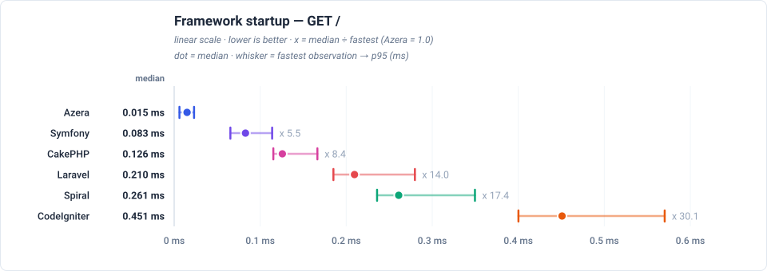

## Total time vs Azera

Total time to serve one of each of the 21 endpoints, relative to Azera (1.0 = the baseline's own total, higher = slower). The closest rival is CakePHP, needing x 4.0 the same total.

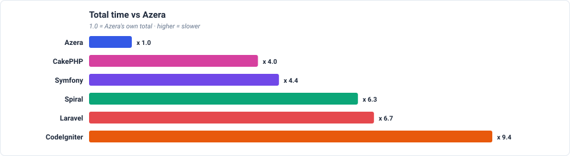

## Feature benchmarks

- **Routing** (`GET /`): Azera at 0.015ms median, x 5.5 faster than Symfony.
- **ORM / Active Record** (`GET /items`): Azera at 0.133ms median, x 3.5 faster than Spiral.
- **Query Builder** (`GET /items-qb`): Azera at 0.090ms median, x 2.5 faster than Symfony.
- **REST API (JSON)** (`GET /api/items`): Azera at 0.038ms median, x 5.8 faster than Symfony.
- **AOP (Aspect-Oriented)** (`GET /features/aop`): Azera at 0.172ms median, x 1.5 faster than Symfony.
- **Cache** (`GET /features/cache`): Azera at 0.013ms median, x 6.2 faster than Symfony.
- **Database Events** (`GET /features/db-events`): Azera at 0.180ms median, x 2.1 faster than Laravel.
- **Event Dispatcher** (`GET /features/events`): Azera at 0.179ms median, x 1.7 faster than Symfony.
- **Validation** (`GET /features/validation`): Azera at 0.018ms median, x 10.2 faster than CakePHP.
- **Config** (`GET /features/config`): Azera at 0.009ms median, x 9.0 faster than Symfony.
- **Request-Scoped Services** (`GET /features/request-scoped`): Azera at 0.008ms median, x 10.4 faster than CakePHP.
- **Rate Limiter** (`GET /features/rate-limit`): Azera at 0.009ms median, x 9.1 faster than Symfony.

### Routing

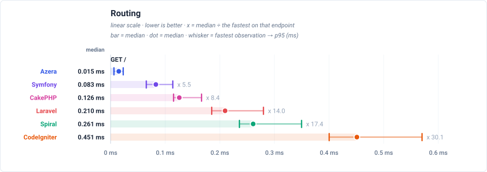

### ORM / Active Record

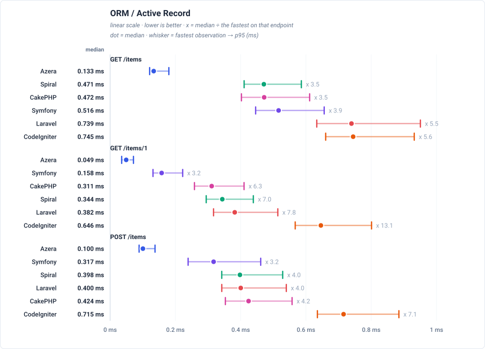

### Query Builder

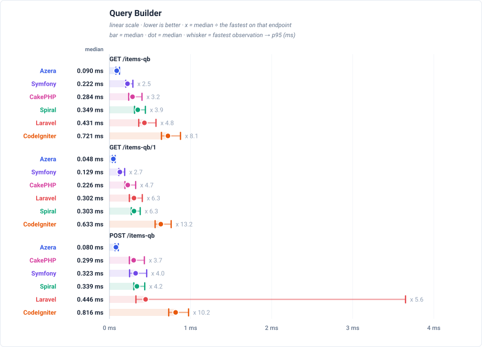

### REST API (JSON)

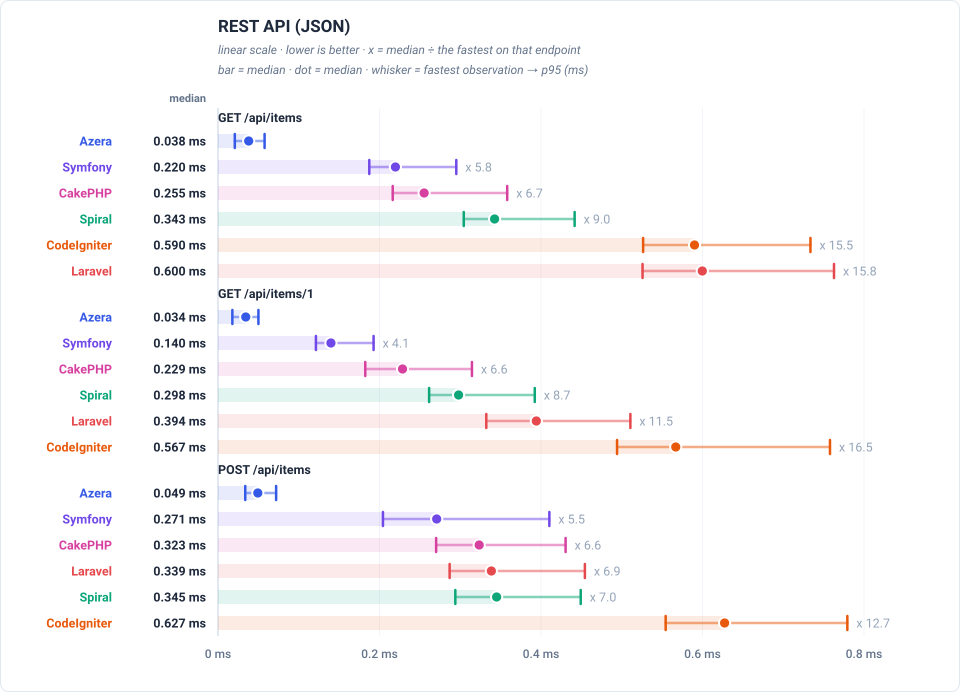

### AOP (Aspect-Oriented)

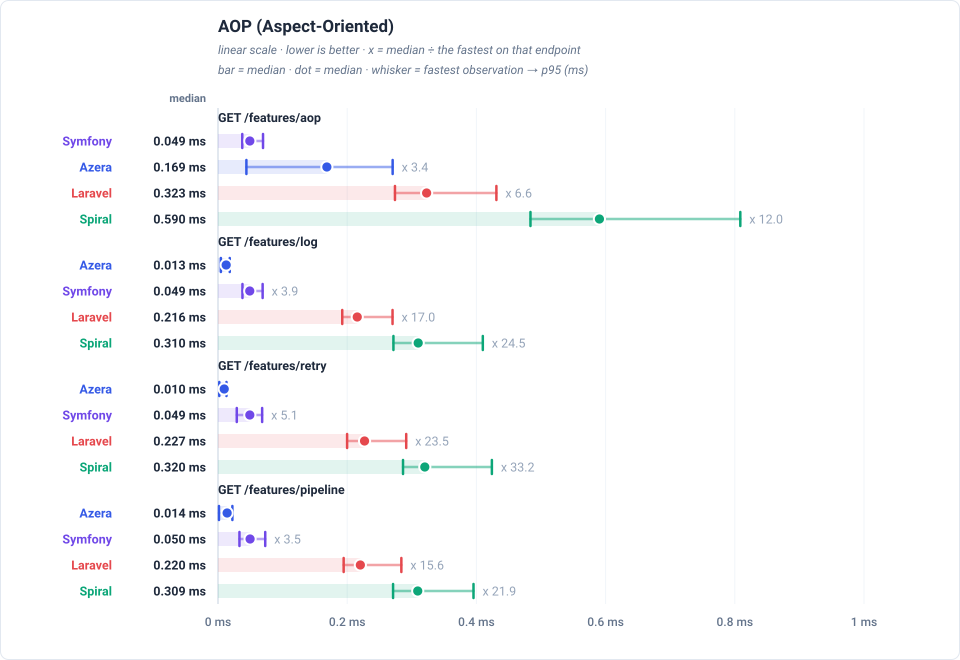

### Cache

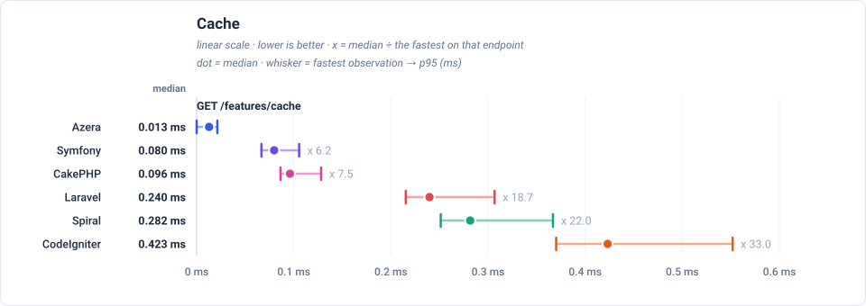

### Database Events

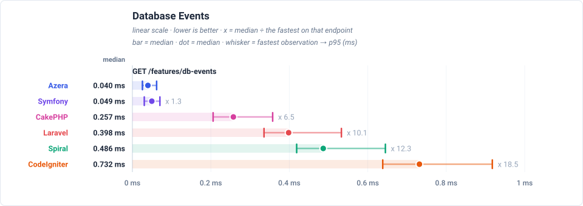

### Event Dispatcher

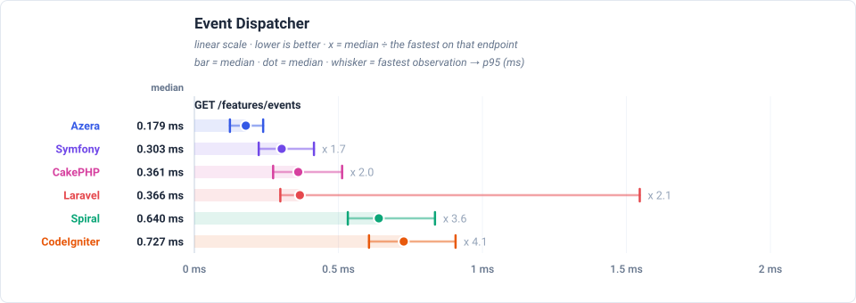

### Validation

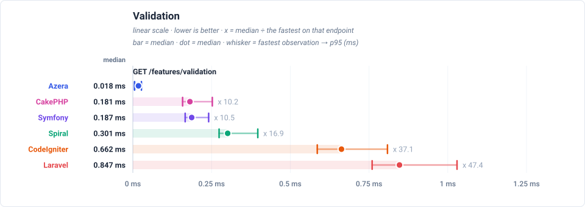

### Config

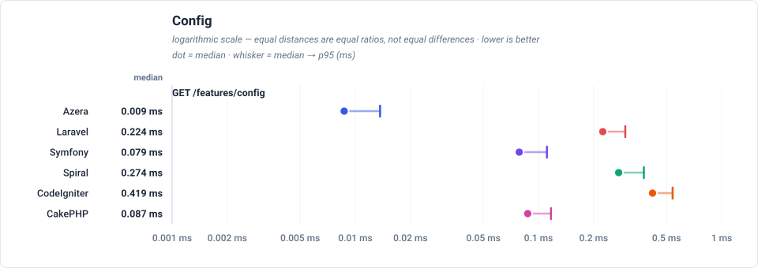

### Request-Scoped Services

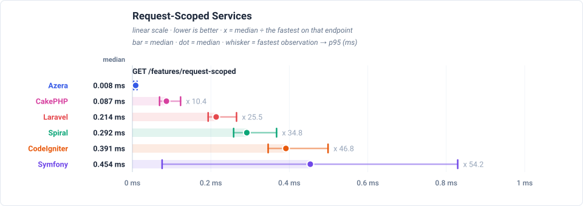

### Rate Limiter

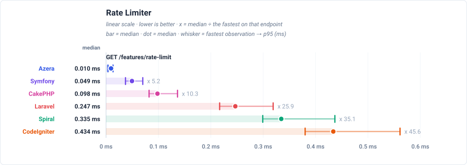

## Peak memory

Peak memory reached on any endpoint. **CodeIgniter** stays under 4.00 MB, against 126 MB for the heaviest framework (x 31.5 more). Each dot is the median endpoint and the whisker spans the lightest to the heaviest endpoint.

## Wins per framework

Number of endpoint races won (lowest trimmed mean) per framework.

| Framework | Wins | Share |
|---|---:|---:|
| Azera | 21 | 100% |
| Laravel | 0 | 0% |
| Symfony | 0 | 0% |
| Spiral | 0 | 0% |
| CodeIgniter | 0 | 0% |
| CakePHP | 0 | 0% |

## Latency by endpoint

Trimmed mean in milliseconds, lower is better. **Bold** = fastest for that endpoint. The workload column states what each request reads or writes — the shared SQLite database holds 1,000 item rows (re-seeded per app × mode), every list endpoint serves page 1 of 20, and every write upserts exactly one sentinel row.

Each cell also shows the request's lifecycle split as `total handle + cleanup` — cleanup is the post-response teardown a long-lived worker performs between requests (terminate() finalizers, request-scoped resets), which the headline number includes.

| Request | Workload | Azera | Laravel | Symfony | Spiral | CodeIgniter | CakePHP |
|---|---|---:|---:|---:|---:|---:|---:|
| `GET /` | no DB — routing + template only | **0.016 0.016+0.000** | 0.220 0.220+0.000 | 0.088 0.087+0.002 | 0.273 0.264+0.009 | 0.466 0.462+0.004 | 0.138 0.138+0.000 |
| `GET /items` | 20 of 1000 items (page 1, + COUNT) | **0.142 0.140+0.002** | 0.765 0.765+0.000 | 0.533 0.531+0.002 | 0.487 0.475+0.012 | 0.767 0.763+0.004 | 0.506 0.506+0.000 |
| `GET /items/1` | 1 item by id | **0.053 0.052+0.001** | 0.396 0.396+0.000 | 0.168 0.167+0.002 | 0.356 0.346+0.010 | 0.665 0.661+0.004 | 0.331 0.330+0.000 |
| `POST /items` | 1 row upserted (sentinel #999999) | **0.108 0.107+0.001** | 0.413 0.412+0.000 | 0.336 0.335+0.001 | 0.413 0.402+0.011 | 0.737 0.733+0.004 | 0.448 0.448+0.000 |
| `GET /items-qb` | 20 of 1000 items (page 1, + COUNT) | **0.096 0.095+0.001** | 0.448 0.448+0.000 | 0.232 0.230+0.002 | 0.363 0.353+0.010 | 0.741 0.737+0.004 | 0.311 0.311+0.000 |
| `GET /items-qb/1` | 1 item by id | **0.052** | 0.315 | 0.140 | 0.314 | 0.649 | 0.246 |
| `POST /items-qb` | 1 row upserted (sentinel #999997) | **0.086** | 1.07 | 0.341 | 0.352 | 0.839 | 0.318 |
| `GET /api/items` | 20 of 1000 items as JSON | **0.041 0.040+0.001** | 0.617 0.617+0.000 | 0.230 0.229+0.002 | 0.356 0.344+0.011 | 0.609 0.606+0.003 | 0.272 0.272+0.000 |
| `GET /api/items/1` | 1 item by id as JSON | **0.037** | 0.410 | 0.149 | 0.313 | 0.590 | 0.244 |
| `POST /api/items` | 1 row upserted (sentinel #999998) | **0.053** | 0.354 | 0.302 | 0.363 | 0.648 | 0.343 |
| `GET /features/aop` | no DB — interceptor pipeline | **0.179 0.178+0.001** | 0.351 0.351+0.000 | 0.268 0.268+0.001 | 0.568 0.562+0.006 | — | — |
| `GET /features/cache` | no DB — cache round-trips | **0.014** | 0.249 | 0.084 | 0.294 | 0.440 | 0.107 |
| `GET /features/log` | no DB — buffered log handlers | **0.013** | 0.224 | 0.082 | 0.281 | — | — |
| `GET /features/retry` | no DB — retry policy | **0.010** | 0.232 | 0.822 | 0.294 | — | — |
| `GET /features/pipeline` | no DB — middleware pipeline | **0.015** | 0.228 | 0.081 | 0.285 | — | — |
| `GET /features/db-events` | 1 event row INSERTed per request | **0.193 0.186+0.006** | 0.401 0.401+0.000 | 0.957 0.947+0.010 | 1.27 1.24+0.030 | 0.838 0.832+0.007 | 0.504 0.504+0.000 |
| `GET /features/events` | no DB — in-process listeners | **0.192** | 0.693 | 0.318 | 0.664 | 0.749 | 0.390 |
| `GET /features/validation` | no DB — validator run | **0.019** | 0.871 | 0.196 | 0.315 | 0.681 | 0.197 |
| `GET /features/config` | no DB — config lookup | **0.009** | 0.229 | 0.083 | 0.281 | 0.419 | 0.097 |
| `GET /features/request-scoped` | no DB — scoped service resolve | **0.009** | 0.221 | 0.467 | 0.302 | 0.406 | 0.099 |
| `GET /features/rate-limit` | no DB — cache-backed limiter | **0.010** | 0.251 | 0.089 | 0.305 | 0.442 | 0.111 |

---

> **Auto-generated.** This page and its charts are produced by the `azera-competition` repository:
> `php run.php --apps=azera,laravel,symfony,spiral,codeigniter,cakephp --out=results/free-for-all-opcache --report`
> then `php scripts/report.php --publish=framework`. Do not edit by hand — re-run the benchmark to update it.

Every chart is a plain SVG generated from the result JSON, so the numbers and the diagrams can never disagree.
