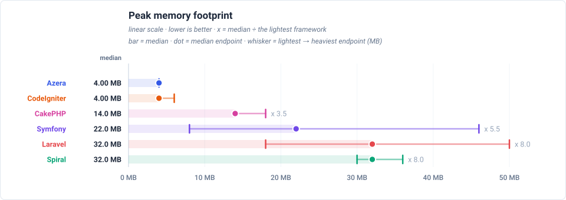

# Framework Competition — Cold Start

PHP-FPM simulation, fresh boot per request: the application boots for every request (harness cold mode, opcache retained). FPM worker management itself is not simulated — these are lower bounds for real FPM latency.

**Environment** — PHP 8.3.6 · Linux 6.8.0-124-generic · OPcache (CLI): yes · 1000 iterations per run over multiple runs, lower is better.

_Measured 2026-09-12T11:45:03+00:00 · azera-framework `b1c4900`_

## Framework startup

The framework's own load cost, timed directly: autoloader + kernel/container build + routes + DB connect, with no request processed — plus the median post-response teardown, because boot and cleanup are the same kind of time: during both, the worker cannot serve another request. **CakePHP** pays 4.48 ms cold against 100.0 ms for Spiral — x 22.3 slower. A warm recycle (worker restart with opcache warm) is cheaper for everyone: 0.009 ms for CakePHP at the low end — CodeIgniter and CakePHP re-bootstrap is a state reset there, not a kernel rebuild. The teardown share of a full request ranges from 0% (Laravel) up to 3% (Spiral).

## Total response times

Total time to serve one of each of the 21 endpoints, relative to Azera (1.0 = the baseline's own total, higher = slower). The closest rival is Symfony, needing x 3.1 the same total.

## Feature benchmarks

- **Routing** (`GET /`): Azera at 0.015ms median, x 5.4 faster than Symfony.
- **ORM / Active Record** (`GET /items`): Azera at 0.134ms median, x 3.9 faster than Symfony.
- **Query Builder** (`GET /items-qb`): Azera at 0.090ms median, x 2.5 faster than Symfony.
- **REST API (JSON)** (`GET /api/items`): Azera at 0.038ms median, x 5.8 faster than Symfony.
- **AOP (Aspect-Oriented)** (`GET /features/aop`): Symfony at 0.050ms median, x 3.5 faster than Azera.
- **Cache** (`GET /features/cache`): Azera at 0.013ms median, x 3.7 faster than Symfony.
- **Database Events** (`GET /features/db-events`): Azera at 0.040ms median, x 1.2 faster than Symfony.
- **Event Dispatcher** (`GET /features/events`): Azera at 0.038ms median, x 1.3 faster than Symfony.
- **Validation** (`GET /features/validation`): Azera at 0.018ms median, x 2.7 faster than Symfony.
- **Config** (`GET /features/config`): Azera at 0.009ms median, x 5.5 faster than Symfony.
- **Request-Scoped Services** (`GET /features/request-scoped`): Azera at 0.009ms median, x 5.7 faster than Symfony.
- **Rate Limiter** (`GET /features/rate-limit`): Azera at 0.010ms median, x 5.2 faster than Symfony.

### Routing

### ORM / Active Record

### Query Builder

### REST API (JSON)

### AOP (Aspect-Oriented)

### Cache

### Database Events

### Event Dispatcher

### Validation

### Config

### Request-Scoped Services

### Rate Limiter

## Peak memory

Peak memory reached on any endpoint. **CodeIgniter** stays under 8.50 MB, against 502 MB for the heaviest framework (x 59.1 more). Each dot is the median endpoint and the whisker spans the lightest to the heaviest endpoint.

## Wins per framework

Number of endpoint races won (lowest trimmed mean) per framework.

| Framework | Wins | Share |
|---|---:|---:|
| Azera | 18 | 86% |
| Symfony | 3 | 14% |
| Laravel | 0 | 0% |
| Spiral | 0 | 0% |
| CodeIgniter | 0 | 0% |
| CakePHP | 0 | 0% |

## Latency by endpoint

Trimmed mean in milliseconds, lower is better. **Bold** = fastest for that endpoint. The workload column states what each request reads or writes — the shared SQLite database holds 1,000 item rows (re-seeded per app × mode), every list endpoint serves page 1 of 20, and every write upserts exactly one sentinel row.

Each cell also shows the request's lifecycle split as `total handle + cleanup` — cleanup is the post-response teardown a long-lived worker performs between requests (terminate() finalizers, request-scoped resets), which the headline number includes.

| Request | Workload | Azera | Laravel | Symfony | Spiral | CodeIgniter | CakePHP |
|---|---|---:|---:|---:|---:|---:|---:|
| `GET /` | no DB — routing + template only | **0.016 0.015+0.001** | 0.218 0.217+0.000 | 0.089 0.087+0.002 | 0.291 0.281+0.010 | 0.474 0.464+0.009 | 0.166 0.165+0.000 |
| `GET /items` | 20 of 1000 items (page 1, + COUNT) | **0.141 0.138+0.003** | 0.760 0.760+0.000 | 0.545 0.542+0.003 | 0.577 0.560+0.017 | 0.780 0.767+0.013 | 0.582 0.581+0.000 |
| `GET /items/1` | 1 item by id | **0.054 0.052+0.002** | 0.403 0.402+0.000 | 0.230 0.228+0.002 | 0.394 0.381+0.013 | 0.672 0.660+0.012 | 0.439 0.439+0.000 |
| `POST /items` | 1 row upserted (sentinel #999999) | **0.109 0.107+0.002** | 0.430 0.429+0.000 | 0.359 0.356+0.003 | 0.445 0.431+0.013 | 0.749 0.736+0.013 | 0.598 0.597+0.000 |
| `GET /items-qb` | 20 of 1000 items (page 1, + COUNT) | **0.096 0.095+0.001** | 0.449 0.448+0.000 | 0.241 0.239+0.002 | 0.391 0.379+0.012 | 0.747 0.734+0.012 | 0.489 0.488+0.000 |
| `GET /items-qb/1` | 1 item by id | **0.051 0.050+0.001** | 0.319 0.319+0.000 | 0.254 0.251+0.002 | 0.347 0.336+0.011 | 0.666 0.654+0.012 | 0.455 0.454+0.000 |
| `POST /items-qb` | 1 row upserted (sentinel #999997) | **0.086 0.084+0.001** | 0.412 0.412+0.000 | 0.348 0.345+0.003 | 0.387 0.374+0.012 | 0.861 0.847+0.014 | 0.569 0.568+0.000 |
| `GET /api/items` | 20 of 1000 items as JSON | **0.041 0.040+0.001** | 0.637 0.637+0.000 | 0.237 0.235+0.002 | 0.452 0.436+0.016 | 0.625 0.614+0.011 | 0.276 0.276+0.000 |
| `GET /api/items/1` | 1 item by id as JSON | **0.038 0.037+0.002** | 0.416 0.416+0.000 | 0.327 0.324+0.002 | 0.355 0.342+0.013 | 0.591 0.579+0.011 | 0.243 0.242+0.000 |
| `POST /api/items` | 1 row upserted (sentinel #999998) | **0.053 0.052+0.002** | 0.356 0.355+0.000 | 0.304 0.301+0.003 | 0.397 0.384+0.013 | 0.658 0.646+0.012 | 0.340 0.340+0.000 |
| `GET /features/aop` | no DB — interceptor pipeline | 0.177 0.176+0.002 | 0.339 0.339+0.000 | **0.054 0.053+0.000** | 0.633 0.617+0.016 | — | — |
| `GET /features/cache` | no DB — cache round-trips | 0.065 0.064+0.001 | 0.298 0.298+0.000 | **0.054 0.053+0.000** | 0.393 0.383+0.011 | 0.442 0.433+0.009 | 0.109 0.109+0.000 |
| `GET /features/log` | no DB — buffered log handlers | **0.014 0.013+0.001** | 0.224 0.224+0.000 | 0.054 0.053+0.000 | 0.330 0.320+0.011 | — | — |
| `GET /features/retry` | no DB — retry policy | **0.010 0.010+0.001** | 0.235 0.235+0.000 | 0.054 0.053+0.000 | 0.344 0.333+0.011 | — | — |
| `GET /features/pipeline` | no DB — middleware pipeline | **0.015 0.014+0.001** | 0.228 0.227+0.000 | 0.053 0.053+0.000 | 0.335 0.324+0.011 | — | — |
| `GET /features/db-events` | 1 event row INSERTed per request | 0.094 0.093+0.001 | 0.408 0.408+0.000 | **0.053 0.052+0.000** | 0.528 0.515+0.014 | 0.745 0.733+0.012 | 0.273 0.272+0.000 |
| `GET /features/events` | no DB — in-process listeners | **0.041 0.040+0.001** | 0.317 0.317+0.000 | 0.053 0.053+0.000 | 0.394 0.383+0.011 | 0.711 0.699+0.012 | 0.183 0.183+0.000 |
| `GET /features/validation` | no DB — validator run | **0.020 0.019+0.001** | 0.890 0.889+0.000 | 0.053 0.053+0.000 | 0.362 0.352+0.011 | 0.684 0.671+0.013 | 0.195 0.194+0.000 |
| `GET /features/config` | no DB — config lookup | **0.009 0.009+0.001** | 0.229 0.229+0.000 | 0.053 0.053+0.000 | 0.324 0.314+0.010 | 0.421 0.413+0.009 | 0.098 0.097+0.000 |
| `GET /features/request-scoped` | no DB — scoped service resolve | **0.009 0.009+0.001** | 0.226 0.225+0.000 | 0.053 0.053+0.000 | 0.346 0.336+0.010 | 0.404 0.395+0.008 | 0.099 0.098+0.000 |
| `GET /features/rate-limit` | no DB — cache-backed limiter | **0.010 0.010+0.001** | 0.255 0.255+0.000 | 0.053 0.053+0.000 | 0.354 0.343+0.010 | 0.444 0.435+0.009 | 0.110 0.110+0.000 |

---

> **Auto-generated.** This page and its charts are produced by the `azera-competition` repository:
> `php run.php --apps=azera,laravel,symfony,spiral,codeigniter,cakephp --out=results/free-for-all-opcache --report`
> then `php scripts/report.php --publish=framework`. Do not edit by hand — re-run the benchmark to update it.

Every chart is a plain SVG generated from the result JSON, so the numbers and the diagrams can never disagree.
