# Framework Competition — Cold Start

PHP-FPM simulation, fresh boot per request: the application boots for every request (harness cold mode, opcache retained). FPM's own worker management is not simulated — real FPM keeps its worker alive and adds nginx + FastCGI overhead on top of this boot, so these are lower bounds for real FPM latency (see the real-fpm view for the measured version).

**Environment** — PHP 8.3.33 · Linux 6.8.0-139-generic · OPcache (CLI): yes · 50 iterations per run over multiple runs, lower is better.

_Measured 2026-09-14T21:26:25+00:00 · azera-framework `6f57113`_

## Framework startup

Three boot models, timed directly by the harness — each band shows boot + median teardown, because during both the worker cannot serve another request:

- **Cold boot** — the very first bootstrap in a fresh PHP process (autoloader + compile + FS cache): what a CLI run, CGI request, or newly spawned worker pays once. **Azera** pays 6.78 ms against 155 ms for Laravel — x 22.8 slower.
- **FPM rebuild** — a recycled PHP-FPM worker never pays the first band: sharing opcache bytecode with the master, it only rebuilds the application (container, routes, DB connect) — 0.046 ms for CodeIgniter at the low end, 17.5 ms for Spiral at the high end. The gap between the cold and FPM bands is the one-time compile cost shared bytecode removes.
- **Warm recycle** — worker restart with opcache warm: 0.004 ms for Azera at the low end — CodeIgniter and CakePHP re-bootstrap is a state reset there, not a kernel rebuild.

 Post-response teardown stays under 1% of a full request for every framework here.

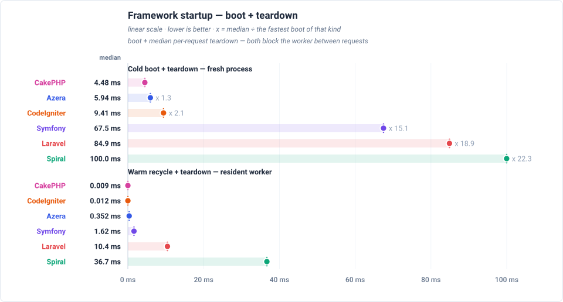

## Total response times

Total time to serve one of each of the 21 endpoints — the sum of the endpoints' medians, not a single response time — relative to Azera (1.0 = the baseline's own total, higher = slower). Each endpoint's median is boot-inclusive occupancy for this view's deployment model, so the total is the worker time one pass over every endpoint costs. The closest rival is CodeIgniter, needing x 1.2 the same total.

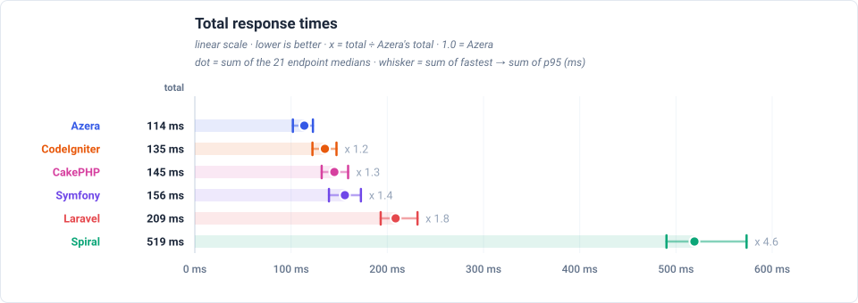

## Feature benchmarks

- **Routing** (`GET /`): Azera at 2.03ms median, x 1.4 faster than CodeIgniter.
- **ORM / Active Record** (`GET /items`): Azera at 3.26ms median, x 1.3 faster than CodeIgniter.
- **Query Builder** (`GET /items-qb`): Azera at 3.00ms median, x 1.4 faster than CodeIgniter.
- **REST API (JSON)** (`GET /api/items`): Azera at 2.99ms median, x 1.4 faster than CodeIgniter.
- **AOP (Aspect-Oriented)** (`GET /features/aop`): Azera at 5.03ms median, x 1.2 faster than Symfony.
- **Cache** (`GET /features/cache`): Azera at 54.5ms median — every framework lands within 5% of it: a shared fixed cost dominates it, so the endpoint does not separate the frameworks.
- **Database Events** (`GET /features/db-events`): Azera at 3.56ms median, x 1.2 faster than CodeIgniter.
- **Event Dispatcher** (`GET /features/events`): Azera at 3.57ms median, x 1.1 faster than CakePHP.
- **Validation** (`GET /features/validation`): Azera at 2.79ms median, x 1.6 faster than CakePHP.
- **Config** (`GET /features/config`): Azera at 2.15ms median, x 1.5 faster than CodeIgniter.
- **Request-Scoped Services** (`GET /features/request-scoped`): Azera at 2.15ms median, x 1.5 faster than CodeIgniter.
- **Rate Limiter** (`GET /features/rate-limit`): Azera at 2.28ms median, x 1.4 faster than CodeIgniter.

### Routing

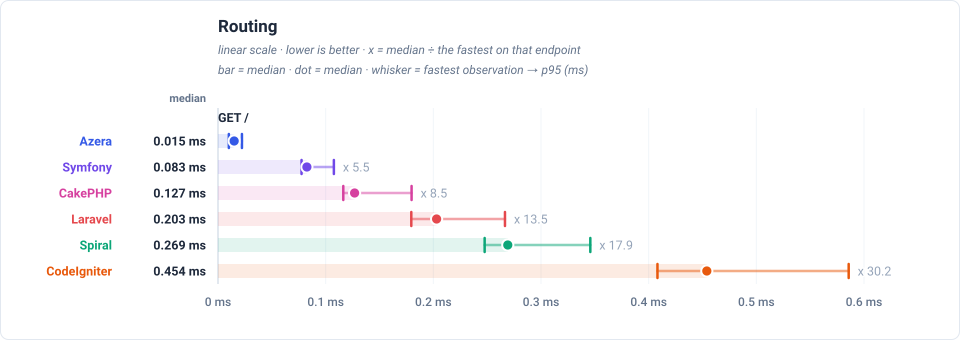

### ORM / Active Record

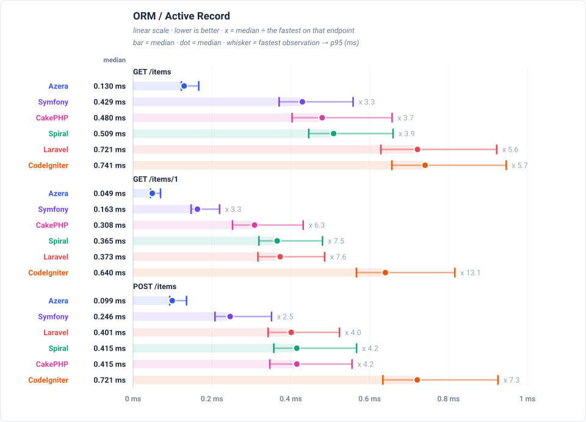

### Query Builder

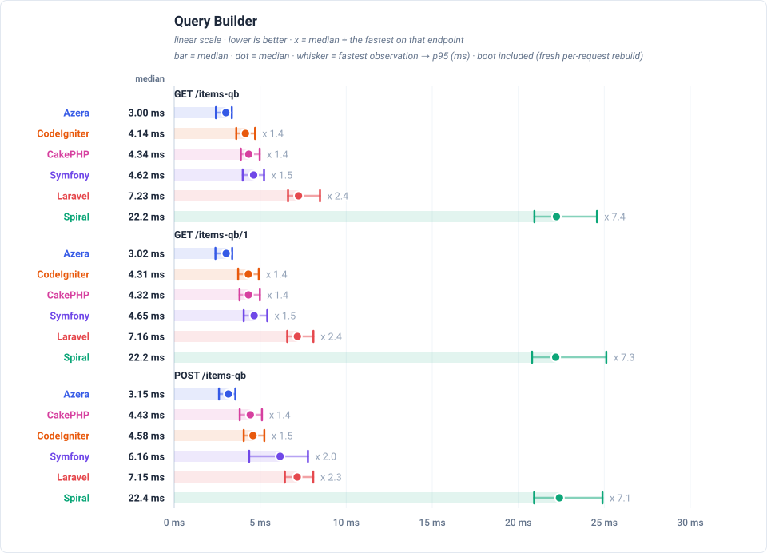

### REST API (JSON)

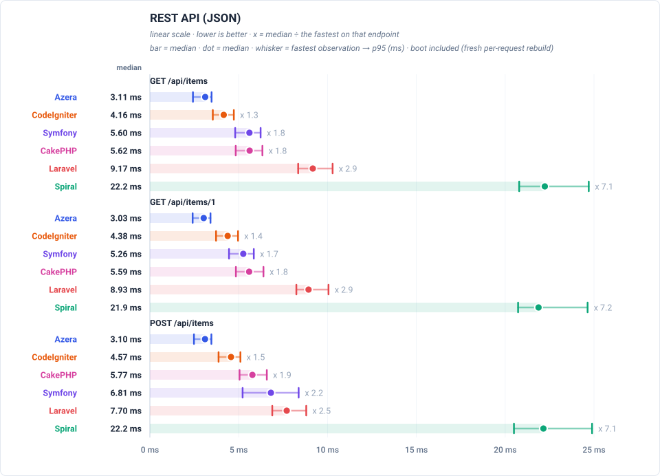

### AOP (Aspect-Oriented)

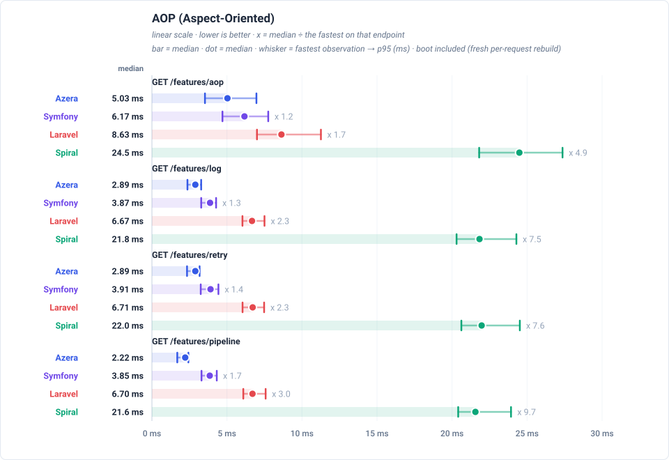

### Cache

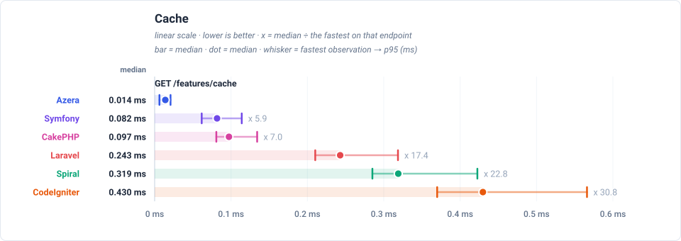

### Database Events

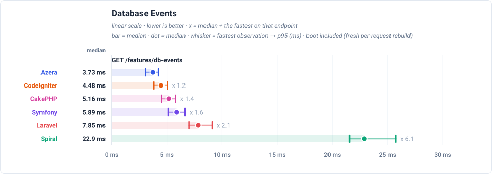

### Event Dispatcher

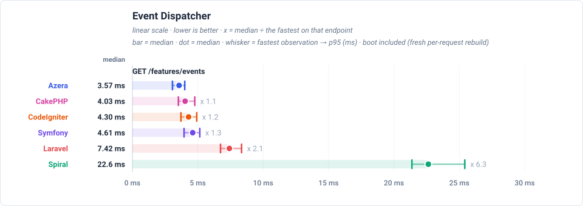

### Validation

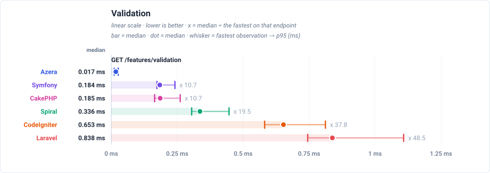

### Config

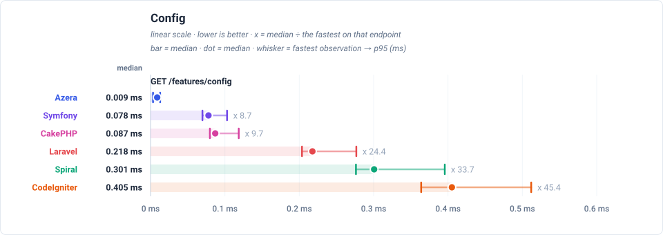

### Request-Scoped Services

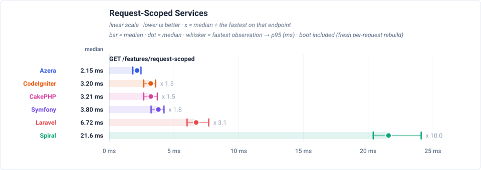

### Rate Limiter

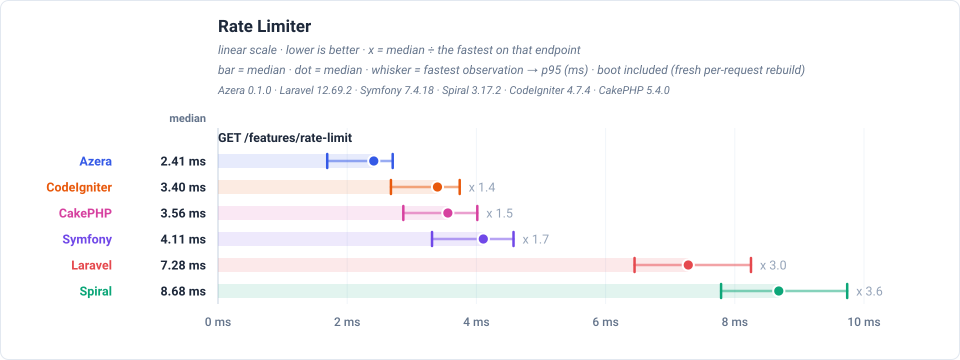

## Wins per framework

Number of endpoint races won (lowest boot-inclusive per-request time) per framework.

| Framework | Wins | Share |
|---|---:|---:|
| Azera | 21 | 100% |
| Laravel | 0 | 0% |
| Symfony | 0 | 0% |
| Spiral | 0 | 0% |
| CodeIgniter | 0 | 0% |
| CakePHP | 0 | 0% |

## Latency by endpoint

Trimmed mean in milliseconds, lower is better. **Bold** = fastest for that endpoint. Every number is END-TO-END per-request occupancy for the view's deployment model: the framework boot of that model is part of the cell, not parked in a separate chart. The workload column states what each request reads or writes — the shared SQLite database holds 1,000 item rows (re-seeded per app × mode), every list endpoint serves page 1 of 20, and every write upserts exactly one sentinel row.

Each cell also shows the request's lifecycle split as `total boot + handle + cleanup` — the terms sum to the headline. Cleanup is the post-response teardown a worker performs between requests (terminate() finalizers, request-scoped resets); handle is the dispatch itself; boot is the framework startup that request waits for in this deployment model.

This dataset times cold requests END-TO-END: every iteration pays a fresh framework boot inside the request clock, exactly like a real PHP-FPM worker building the app before serving. The boot share is therefore inside both the headline and the `boot` term of the sub-line — the totals here are the numbers a user waits for.

| Request | Workload | Azera | Laravel | Symfony | Spiral | CodeIgniter | CakePHP |
|---|---|---:|---:|---:|---:|---:|---:|
| `GET /` | no DB — routing + template only | **2.05 0.06+1.99+0.00** | 6.37 4.08+2.29+0.00 | 3.66 1.60+2.06+0.00 | 22.0 17.6+4.4+0.0 | 2.95 0.02+2.92+0.01 | 3.12 0.39+2.73+0.00 |
| `GET /items` | 20 of 1000 items (page 1, + COUNT) | **3.29 0.06+3.22+0.01** | 8.00 4.08+3.92+0.00 | 6.11 1.59+4.52+0.00 | 23.0 17.4+5.6+0.0 | 4.23 0.03+4.18+0.02 | 5.91 0.38+5.53+0.00 |
| `GET /items/1` | 1 item by id | **3.01 0.06+2.94+0.01** | 7.66 4.06+3.60+0.00 | 5.26 1.60+3.66+0.00 | 22.9 17.4+5.5+0.0 | 4.35 0.02+4.31+0.02 | 5.71 0.39+5.32+0.00 |
| `POST /items` | 1 row upserted (sentinel #999999) | **3.42 0.05+3.36+0.01** | 7.68 4.06+3.62+0.00 | 7.02 1.63+5.38+0.01 | 23.3 17.5+5.8+0.0 | 4.52 0.03+4.47+0.02 | 5.95 0.39+5.56+0.00 |
| `GET /items-qb` | 20 of 1000 items (page 1, + COUNT) | **3.03 0.06+2.97+0.00** | 7.35 4.04+3.31+0.00 | 4.68 1.59+3.09+0.00 | 22.5 17.5+5.0+0.0 | 4.20 0.03+4.15+0.02 | 4.40 0.39+4.01+0.00 |
| `GET /items-qb/1` | 1 item by id | **3.04 0.06+2.98+0.00** | 7.28 4.05+3.23+0.00 | 4.73 1.62+3.11+0.00 | 22.5 17.5+5.0+0.0 | 4.37 0.02+4.33+0.02 | 4.40 0.39+4.01+0.00 |
| `POST /items-qb` | 1 row upserted (sentinel #999997) | **3.18 0.06+3.12+0.00** | 7.26 4.01+3.25+0.00 | 6.28 1.60+4.68+0.00 | 22.7 17.6+5.1+0.0 | 4.65 0.03+4.60+0.02 | 4.54 0.38+4.16+0.00 |
| `GET /api/items` | 20 of 1000 items as JSON | **3.02 0.06+2.96+0.00** | 9.26 4.06+5.20+0.00 | 5.58 1.60+3.98+0.00 | 22.4 17.4+5.0+0.0 | 4.18 0.03+4.13+0.02 | 5.61 0.40+5.21+0.00 |
| `GET /api/items/1` | 1 item by id as JSON | **2.97 0.05+2.91+0.01** | 9.07 4.05+5.02+0.00 | 5.19 1.59+3.60+0.00 | 22.2 17.4+4.8+0.0 | 4.37 0.03+4.32+0.02 | 5.62 0.40+5.22+0.00 |
| `POST /api/items` | 1 row upserted (sentinel #999998) | **3.06 0.05+3.00+0.01** | 7.76 4.05+3.71+0.00 | 6.84 1.61+5.23+0.00 | 22.7 17.6+5.1+0.0 | 4.54 0.03+4.49+0.02 | 5.77 0.38+5.39+0.00 |
| `GET /features/aop` | no DB — interceptor pipeline | **5.22 0.06+5.16+0.00** | 8.98 4.10+4.88+0.00 | 6.25 1.60+4.65+0.00 | 24.7 17.5+7.2+0.0 | — | — |
| `GET /features/cache` | no DB — cache round-trips | **54.5 0.1+54.4+0.0** | 59.6 4.6+55.0+0.0 | 57.1 1.9+55.2+0.0 | 74.0 17.7+56.3+0.0 | 55.2 0.0+55.2+0.0 | 56.3 0.4+55.9+0.0 |
| `GET /features/log` | no DB — buffered log handlers | **2.92 0.05+2.87+0.00** | 6.76 3.98+2.78+0.00 | 3.91 1.59+2.32+0.00 | 22.1 17.5+4.6+0.0 | — | — |
| `GET /features/retry` | no DB — retry policy | **2.91 0.06+2.85+0.00** | 6.80 4.00+2.80+0.00 | 3.95 1.62+2.33+0.00 | 22.2 17.7+4.5+0.0 | — | — |
| `GET /features/pipeline` | no DB — middleware pipeline | **2.23 0.06+2.17+0.00** | 6.80 4.00+2.80+0.00 | 3.90 1.58+2.32+0.00 | 21.8 17.3+4.5+0.0 | — | — |
| `GET /features/db-events` | 1 event row INSERTed per request | **3.60 0.05+3.55+0.00** | 7.95 4.06+3.89+0.00 | 5.93 1.62+4.30+0.01 | 23.5 17.5+6.0+0.0 | 4.47 0.03+4.42+0.02 | 5.18 0.39+4.79+0.00 |
| `GET /features/events` | no DB — in-process listeners | **3.61 0.06+3.55+0.00** | 7.52 4.05+3.47+0.00 | 4.66 1.56+3.10+0.00 | 23.1 17.6+5.5+0.0 | 4.36 0.03+4.31+0.02 | 4.09 0.39+3.70+0.00 |
| `GET /features/validation` | no DB — validator run | **2.82 0.06+2.76+0.00** | 8.31 4.03+4.28+0.00 | 4.58 1.58+3.00+0.00 | 22.3 17.5+4.8+0.0 | 4.54 0.02+4.50+0.02 | 4.40 0.38+4.02+0.00 |
| `GET /features/config` | no DB — config lookup | **2.17 0.06+2.11+0.00** | 6.84 4.01+2.83+0.00 | 3.93 1.60+2.33+0.00 | 21.8 17.4+4.4+0.0 | 3.23 0.03+3.19+0.01 | 3.25 0.39+2.86+0.00 |
| `GET /features/request-scoped` | no DB — scoped service resolve | **2.18 0.06+2.12+0.00** | 6.82 4.00+2.82+0.00 | 3.83 1.55+2.28+0.00 | 21.9 17.4+4.5+0.0 | 3.23 0.03+3.19+0.01 | 3.25 0.39+2.86+0.00 |
| `GET /features/rate-limit` | no DB — cache-backed limiter | **2.30 0.05+2.25+0.00** | 7.18 4.07+3.11+0.00 | 3.94 1.59+2.35+0.00 | 22.2 17.4+4.8+0.0 | 3.25 0.03+3.20+0.02 | 3.45 0.38+3.07+0.00 |

---

> **Auto-generated.** This page and its charts are produced by the `azera-competition` repository:
> `php run.php --apps=azera,laravel,symfony,spiral,codeigniter,cakephp --warm --cold --seed --out=results/free-for-all-opcache-iso`
> then `php scripts/derive-fpm.php results/free-for-all-opcache-iso` and `php scripts/report.php --publish=framework`. Do not edit by hand — re-run the benchmark to update it.

Every chart is a plain SVG generated from the result JSON, so the numbers and the diagrams can never disagree.
