# Laravel vs Symfony

The same dataset, narrowed to two frameworks. Any subset works ??? no code change.

**Environment** — PHP 8.3.6 · Linux 6.8.0-124-generic · OPcache (CLI): yes · 1000 iterations per run over multiple runs, lower is better.

_Measured 2026-09-11T20:28:50+00:00 · azera-framework `b1c4900`_

## Framework startup

The framework's own load cost, timed directly: autoloader + kernel/container build + routes + DB connect, with no request processed. **Symfony** boots cold in 67.5 ms against 84.9 ms for Laravel — x 1.3 slower. A warm recycle (worker restart with opcache warm) is cheaper for everyone: 1.62 ms for Symfony at the low end — CodeIgniter and CakePHP re-bootstrap is a guarded no-op there. Beyond the boot itself, the split of every request shows how much of each request is post-response teardown: from 0% (Laravel) up to 1% (Symfony) — the worker-loop cleanup a RoadRunner-style server pays per request.

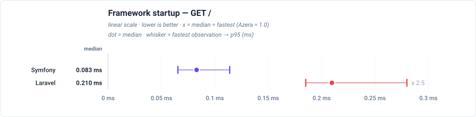

## Total time vs Laravel

Total time to serve one of each of the 21 endpoints, relative to Laravel (1.0 = the baseline's own total, higher = slower). The closest rival is Symfony, needing x 0.7 the same total.

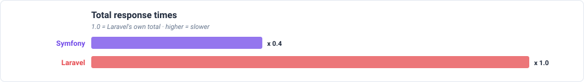

## Feature benchmarks

- **Routing** (`GET /`): Symfony at 0.083ms median, x 2.5 faster than Laravel.
- **ORM / Active Record** (`GET /items`): Symfony at 0.516ms median, x 1.4 faster than Laravel.
- **Query Builder** (`GET /items-qb`): Symfony at 0.222ms median, x 1.9 faster than Laravel.
- **REST API (JSON)** (`GET /api/items`): Symfony at 0.220ms median, x 2.7 faster than Laravel.
- **AOP (Aspect-Oriented)** (`GET /features/aop`): Symfony at 0.251ms median, x 1.2 faster than Laravel.
- **Cache** (`GET /features/cache`): Symfony at 0.080ms median, x 3.0 faster than Laravel.
- **Database Events** (`GET /features/db-events`): Laravel at 0.377ms median, x 2.5 faster than Symfony.
- **Event Dispatcher** (`GET /features/events`): Symfony at 0.303ms median, x 1.2 faster than Laravel.
- **Validation** (`GET /features/validation`): Symfony at 0.187ms median, x 4.5 faster than Laravel.
- **Config** (`GET /features/config`): Symfony at 0.078ms median, x 2.8 faster than Laravel.
- **Request-Scoped Services** (`GET /features/request-scoped`): Laravel at 0.214ms median, x 2.1 faster than Symfony.
- **Rate Limiter** (`GET /features/rate-limit`): Symfony at 0.084ms median, x 2.9 faster than Laravel.

### Routing

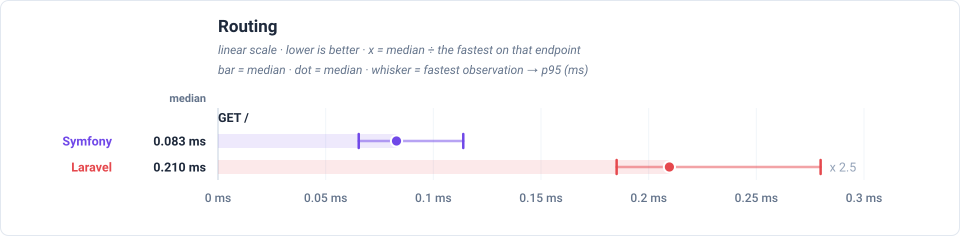

### ORM / Active Record

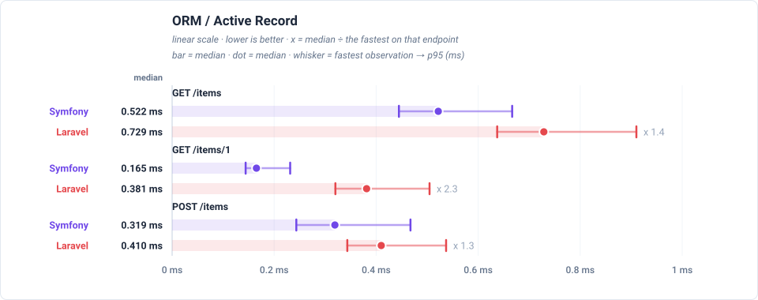

### Query Builder

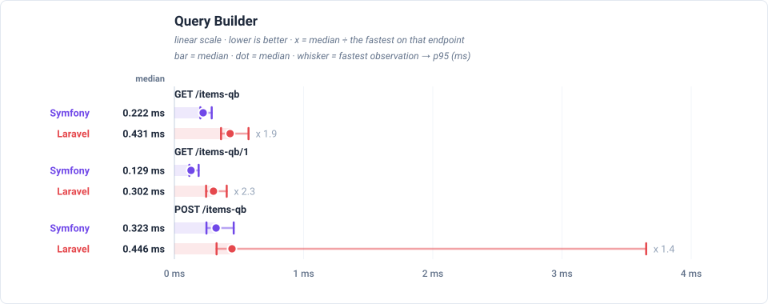

### REST API (JSON)

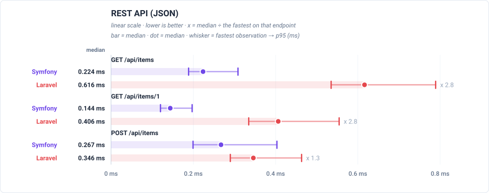

### AOP (Aspect-Oriented)

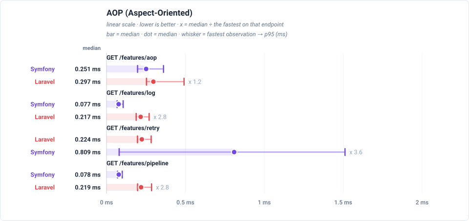

### Cache

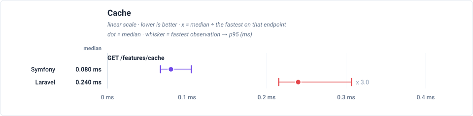

### Database Events

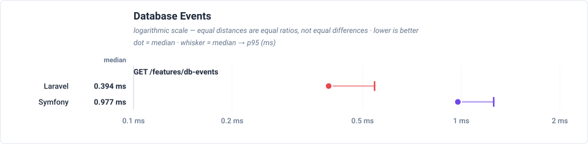

### Event Dispatcher

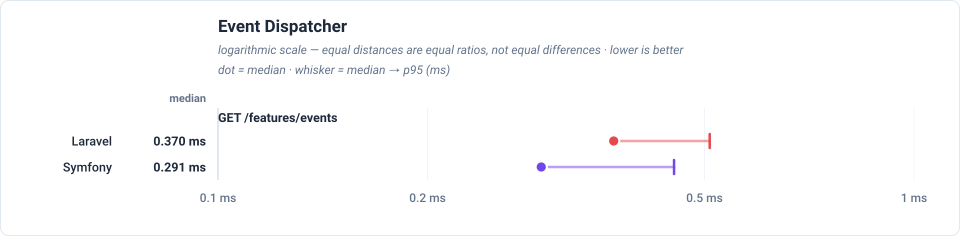

### Validation

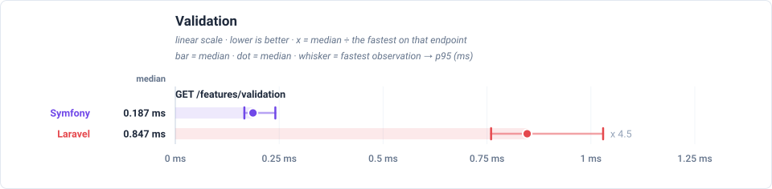

### Config

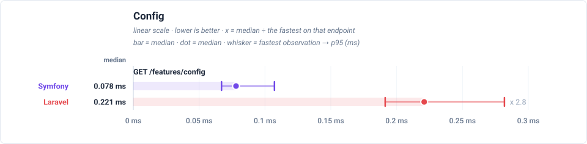

### Request-Scoped Services

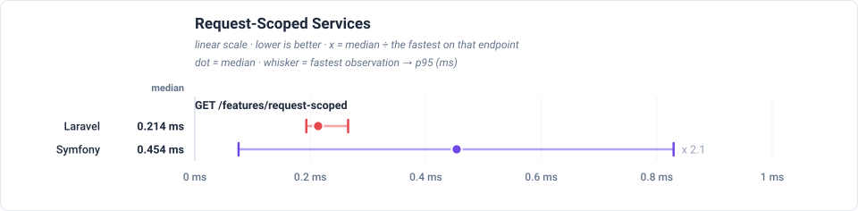

### Rate Limiter

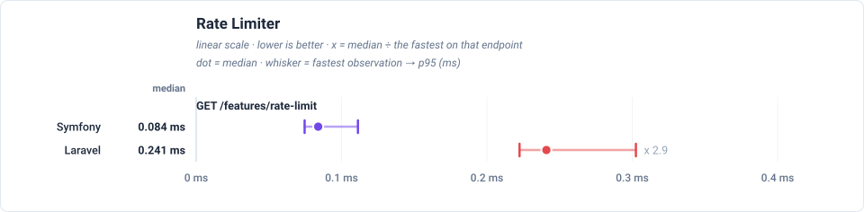

## Peak memory

Peak memory reached on any endpoint. **Laravel** stays under 16.0 MB, against 126 MB for the heaviest framework (x 7.9 more). Each dot is the median endpoint and the whisker spans the lightest to the heaviest endpoint.

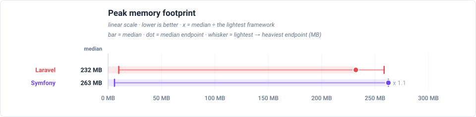

## Latency by endpoint

Trimmed mean in milliseconds, lower is better. **Bold** = fastest for that endpoint. The workload column states what each request reads or writes — the shared SQLite database holds 1,000 item rows (re-seeded per app × mode), every list endpoint serves page 1 of 20, and every write upserts exactly one sentinel row.

Each cell also shows the request's lifecycle split as `total handle + cleanup` — cleanup is the post-response teardown a long-lived worker performs between requests (terminate() finalizers, request-scoped resets), which the headline number includes.

| Request | Workload | Laravel | Symfony |
|---|---|---:|---:|
| `GET /` | no DB — routing + template only | 0.220 0.220+0.000 | **0.088 0.087+0.002** |
| `GET /items` | 20 of 1000 items (page 1, + COUNT) | 0.765 0.765+0.000 | **0.533 0.531+0.002** |
| `GET /items/1` | 1 item by id | 0.396 0.396+0.000 | **0.168 0.167+0.002** |
| `POST /items` | 1 row upserted (sentinel #999999) | 0.413 0.412+0.000 | **0.336 0.335+0.001** |
| `GET /items-qb` | 20 of 1000 items (page 1, + COUNT) | 0.448 0.448+0.000 | **0.232 0.230+0.002** |
| `GET /items-qb/1` | 1 item by id | 0.315 | **0.140** |
| `POST /items-qb` | 1 row upserted (sentinel #999997) | 1.07 | **0.341** |
| `GET /api/items` | 20 of 1000 items as JSON | 0.617 0.617+0.000 | **0.230 0.229+0.002** |
| `GET /api/items/1` | 1 item by id as JSON | 0.410 | **0.149** |
| `POST /api/items` | 1 row upserted (sentinel #999998) | 0.354 | **0.302** |
| `GET /features/aop` | no DB — interceptor pipeline | 0.351 0.351+0.000 | **0.268 0.268+0.001** |
| `GET /features/cache` | no DB — cache round-trips | 0.249 | **0.084** |
| `GET /features/log` | no DB — buffered log handlers | 0.224 | **0.082** |
| `GET /features/retry` | no DB — retry policy | **0.232** | 0.822 |
| `GET /features/pipeline` | no DB — middleware pipeline | 0.228 | **0.081** |
| `GET /features/db-events` | 1 event row INSERTed per request | **0.401 0.401+0.000** | 0.957 0.947+0.010 |
| `GET /features/events` | no DB — in-process listeners | 0.693 | **0.318** |
| `GET /features/validation` | no DB — validator run | 0.871 | **0.196** |
| `GET /features/config` | no DB — config lookup | 0.229 | **0.083** |
| `GET /features/request-scoped` | no DB — scoped service resolve | **0.221** | 0.467 |
| `GET /features/rate-limit` | no DB — cache-backed limiter | 0.251 | **0.089** |

---

> **Auto-generated.** This page and its charts are produced by the `azera-competition` repository:
> `php run.php --apps=azera,laravel,symfony,spiral,codeigniter,cakephp --out=results/free-for-all-opcache --report`
> then `php scripts/report.php --publish=framework`. Do not edit by hand — re-run the benchmark to update it.

Every chart is a plain SVG generated from the result JSON, so the numbers and the diagrams can never disagree.
