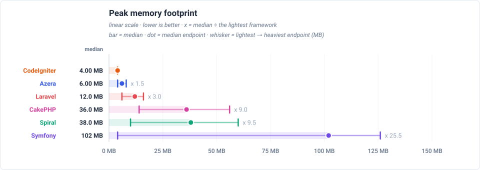

# Peak Memory Footprint

Highest peak memory per framework. Low memory is what makes Azera cheap to run at scale.

**Environment** — PHP 8.3.33 · Linux 6.8.0-139-generic · OPcache (CLI): yes · 1000 iterations per run over multiple runs, lower is better.

_Measured 2026-09-14T21:26:25+00:00 · azera-framework `6f57113`_

## Peak memory

Peak memory reached on any endpoint. **Azera** stays under 4.00 MB, against 28.0 MB for the heaviest framework (x 7.0 more). Each dot is the median endpoint and the whisker spans the lightest to the heaviest endpoint.

## Latency by endpoint

Trimmed mean in milliseconds, lower is better. **Bold** = fastest for that endpoint. Every number is END-TO-END per-request occupancy for the view's deployment model: the framework boot of that model is part of the cell, not parked in a separate chart. The workload column states what each request reads or writes — the shared SQLite database holds 1,000 item rows (re-seeded per app × mode), every list endpoint serves page 1 of 20, and every write upserts exactly one sentinel row.

Each cell also shows the request's lifecycle split as `total boot + handle + cleanup` — the terms sum to the headline. Cleanup is the post-response teardown a worker performs between requests (terminate() finalizers, request-scoped resets); handle is the dispatch itself; boot is the framework startup that request waits for in this deployment model.

These rows are end-to-end for a resident worker: every headline and every chart point adds the worker's boot (warm recycle, 0.000–17.5 ms here) to the measured request, so a cell is the time one request keeps that worker busy — the number to read when workers are recycled per request or requests queue behind one pool.

| Request | Workload | Azera | Laravel | Symfony | Spiral | CodeIgniter | CakePHP |
|---|---|---:|---:|---:|---:|---:|---:|
| `GET /` | no DB — routing + template only | **0.017 0.001+0.015+0.001** | 2.69 2.48+0.21+0.00 | 0.631 0.544+0.085+0.002 | 17.8 17.5+0.3+0.0 | 0.462 0.000+0.453+0.009 | 0.144 0.006+0.138+0.000 |
| `GET /items` | 20 of 1000 items (page 1, + COUNT) | **0.140 0.001+0.136+0.003** | 3.22 2.48+0.74+0.00 | 1.07 0.55+0.52+0.00 | 18.1 17.6+0.5+0.0 | 0.757 0.000+0.745+0.012 | 0.511 0.006+0.505+0.000 |
| `GET /items/1` | 1 item by id | **0.051 0.001+0.048+0.002** | 2.86 2.48+0.38+0.00 | 0.713 0.544+0.167+0.002 | 17.9 17.5+0.4+0.0 | 0.646 0.000+0.634+0.012 | 0.333 0.006+0.327+0.000 |
| `POST /items` | 1 row upserted (sentinel #999999) | **0.106 0.001+0.103+0.002** | 2.89 2.48+0.41+0.00 | 0.814 0.543+0.268+0.003 | 18.0 17.6+0.4+0.0 | 0.728 0.000+0.716+0.012 | 0.440 0.006+0.434+0.000 |
| `GET /items-qb` | 20 of 1000 items (page 1, + COUNT) | **0.093 0.001+0.091+0.001** | 2.90 2.47+0.43+0.00 | 0.777 0.544+0.231+0.002 | 17.9 17.5+0.4+0.0 | 0.729 0.000+0.717+0.012 | 0.301 0.006+0.295+0.000 |
| `GET /items-qb/1` | 1 item by id | **0.051 0.001+0.049+0.001** | 2.79 2.48+0.31+0.00 | 0.678 0.544+0.132+0.002 | 17.9 17.6+0.3+0.0 | 0.645 0.000+0.633+0.012 | 0.240 0.006+0.234+0.000 |
| `POST /items-qb` | 1 row upserted (sentinel #999997) | **0.084 0.001+0.082+0.001** | 2.88 2.48+0.40+0.00 | 0.807 0.543+0.261+0.003 | 17.9 17.5+0.4+0.0 | 0.844 0.000+0.831+0.013 | 0.309 0.006+0.303+0.000 |
| `GET /api/items` | 20 of 1000 items as JSON | **0.041 0.001+0.039+0.001** | 3.10 2.48+0.62+0.00 | 0.775 0.544+0.229+0.002 | 18.0 17.6+0.4+0.0 | 0.605 0.000+0.595+0.010 | 0.269 0.006+0.263+0.000 |
| `GET /api/items/1` | 1 item by id as JSON | **0.037 0.001+0.035+0.001** | 2.88 2.48+0.40+0.00 | 0.688 0.544+0.142+0.002 | 17.9 17.6+0.3+0.0 | 0.572 0.000+0.562+0.010 | 0.241 0.006+0.235+0.000 |
| `POST /api/items` | 1 row upserted (sentinel #999998) | **0.054 0.001+0.051+0.002** | 2.83 2.48+0.35+0.00 | 0.772 0.544+0.226+0.002 | 17.9 17.5+0.4+0.0 | 0.644 0.000+0.633+0.011 | 0.337 0.006+0.331+0.000 |
| `GET /features/aop` | no DB — interceptor pipeline | **0.131 0.001+0.129+0.001** | 2.81 2.48+0.33+0.00 | 0.740 0.544+0.194+0.002 | 18.1 17.6+0.5+0.0 | — | — |
| `GET /features/cache` | no DB — cache round-trips | **0.014 0.001+0.012+0.001** | 2.72 2.48+0.24+0.00 | 0.630 0.544+0.084+0.002 | 17.9 17.6+0.3+0.0 | 0.404 0.000+0.396+0.008 | 0.112 0.006+0.106+0.000 |
| `GET /features/log` | no DB — buffered log handlers | **0.014 0.001+0.012+0.001** | 2.70 2.48+0.22+0.00 | 0.625 0.544+0.079+0.002 | 17.9 17.6+0.3+0.0 | — | — |
| `GET /features/retry` | no DB — retry policy | **0.011 0.001+0.009+0.001** | 2.71 2.48+0.23+0.00 | 0.629 0.543+0.084+0.002 | 17.9 17.6+0.3+0.0 | — | — |
| `GET /features/pipeline` | no DB — middleware pipeline | **0.015 0.001+0.013+0.001** | 2.70 2.48+0.22+0.00 | 0.626 0.543+0.081+0.002 | 17.9 17.6+0.3+0.0 | — | — |
| `GET /features/db-events` | 1 event row INSERTed per request | **0.049 0.001+0.047+0.001** | 2.87 2.48+0.39+0.00 | 0.744 0.544+0.198+0.002 | 18.0 17.5+0.5+0.0 | 0.740 0.000+0.728+0.012 | 0.272 0.006+0.266+0.000 |
| `GET /features/events` | no DB — in-process listeners | **0.040 0.001+0.038+0.001** | 2.78 2.47+0.31+0.00 | 0.656 0.544+0.110+0.002 | 17.9 17.5+0.4+0.0 | 0.692 0.000+0.680+0.012 | 0.159 0.006+0.153+0.000 |
| `GET /features/validation` | no DB — validator run | **0.020 0.001+0.018+0.001** | 3.33 2.48+0.85+0.00 | 0.737 0.544+0.191+0.002 | 17.9 17.6+0.3+0.0 | 0.667 0.000+0.654+0.013 | 0.199 0.006+0.193+0.000 |
| `GET /features/config` | no DB — config lookup | **0.010 0.001+0.008+0.001** | 2.71 2.48+0.23+0.00 | 0.626 0.544+0.080+0.002 | 17.8 17.5+0.3+0.0 | 0.415 0.000+0.407+0.008 | 0.103 0.006+0.097+0.000 |
| `GET /features/request-scoped` | no DB — scoped service resolve | **0.010 0.001+0.008+0.001** | 2.70 2.48+0.22+0.00 | 0.625 0.544+0.079+0.002 | 17.9 17.6+0.3+0.0 | 0.404 0.000+0.396+0.008 | 0.101 0.006+0.095+0.000 |
| `GET /features/rate-limit` | no DB — cache-backed limiter | **0.010 0.001+0.008+0.001** | 2.73 2.48+0.25+0.00 | 0.633 0.544+0.087+0.002 | 17.9 17.6+0.3+0.0 | 0.404 0.000+0.396+0.008 | 0.113 0.006+0.107+0.000 |

---

> **Auto-generated.** This page and its charts are produced by the `azera-competition` repository:
> `php run.php --apps=azera,laravel,symfony,spiral,codeigniter,cakephp --warm --cold --seed --out=results/free-for-all-opcache-iso`
> then `php scripts/derive-fpm.php results/free-for-all-opcache-iso` and `php scripts/report.php --publish=framework`. Do not edit by hand — re-run the benchmark to update it.

Every chart is a plain SVG generated from the result JSON, so the numbers and the diagrams can never disagree.
