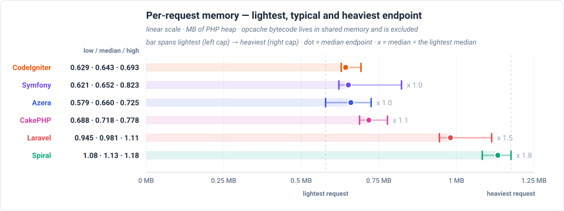

# Framework Competition — Real PHP-FPM

Real nginx + PHP-FPM serving over HTTP: the framework boots for every request, which is what PHP actually runs in production. The pool's worker-recycling setting is stated with the server floor below, since it changes what each row contains. End-to-end HTTP over loopback — includes the constant webserver overhead (see floor-http/floor-php in the dataset). Single sequential client.

**Environment** — PHP 8.3.33 · Linux 6.8.0-139-generic · OPcache (CLI): no · 1000 iterations per run over 10 runs, lower is better.

_Measured 2026-09-15T23:21:30+00:00_

## Framework startup GET /

Time from PHP start until the framework is ready to serve, measured inside the FPM entry script — the boot every request waits for on this deployment, because nginx/PHP-FPM re-runs the entry script per request.

- The fastest and slowest framework on this band are named by the chart below; the multiplier beside each row states how many times the fastest boot it needed.
- Each framework's boot is reduced to one statistic (median of the probe samples), and the samples per framework are recorded in the dataset.

## Total response times

Total time to serve one pass over every benchmarked endpoint — each framework's sum of its endpoint medians, not a single response time — drawn relative to the baseline, so a row states how many times the baseline's own total it needed. Each endpoint's median is boot-inclusive occupancy for this view's deployment model, so the total is the worker time one pass over every endpoint costs. The chart orders the frameworks by that total and prints each one's multiplier beside its row.

## Feature benchmarks

One race per framework feature, each run as a real request against a real database. Every figure — the winner of each race and the margin over the runner-up — is in that feature's own chart below, which anchors each endpoint at its fastest framework.

- **Routing** (`GET /`) — dispatches a plain request through the router and returns a rendered template — no database access.
- **ORM / Active Record** (`GET /items`) — loads one page of the 1,000 seeded rows through each framework's ORM / Active Record layer: 20 items plus a COUNT for the pagination total.
- **Query Builder** (`GET /items-qb`) — builds the same page of 20 items with each framework's query builder instead of its ORM, so the two data-access styles can be compared directly.
- **REST API (JSON)** (`GET /api/items`) — serves the same page of items as a JSON response rather than HTML, which adds serialization to the ORM work.
- **AOP (Aspect-Oriented)** (`GET /features/aop`) — runs a request through an interceptor pipeline — logging, retry and middleware aspects wrapped around the handler. Only frameworks with an AOP layer take part.
- **Cache** (`GET /features/cache`) — reads a COUNT(*) over the 1,000 rows through the framework's cache with a 10-second TTL, so a hit costs no database work and a miss runs the query.
- **Database Events** (`GET /features/db-events`) — inserts one event row per request and lets the framework's database events fire around that write.
- **Event Dispatcher** (`GET /features/events`) — dispatches an in-process event to registered listeners.
- **Validation** (`GET /features/validation`) — validates a payload with the framework's own validator.
- **Config** (`GET /features/config`) — resolves a value from the framework's config repository.
- **Request-Scoped Services** (`GET /features/request-scoped`) — resolves a service scoped to the request from the container.
- **Rate Limiter** (`GET /features/rate-limit`) — checks a cache-backed rate limiter.

### Routing

### ORM / Active Record

### Query Builder

### REST API (JSON)

### AOP (Aspect-Oriented)

### Cache

### Database Events

### Event Dispatcher

### Validation

### Config

### Request-Scoped Services

### Rate Limiter

## Per-request memory

How much memory a single request needs, for every framework, measured inside the FPM worker that served it. The numbers come from the FPM worker process itself: because the entry script is torn down when the request ends, it appends one sample as it exits, and the harness reads that back. The pool is `pm = static` with `max_children = 1` and `max_requests = 0`, so this is ONE worker that stays alive for the whole block — which is why it has retained memory worth reporting at all.

A request's high-water mark is taken from the framework-ready boundary of the entry script to the moment the response is finished, with the mark reset at that boundary — so it counts exactly what serving the request cost, and never bleeds into the next one. Each endpoint was probed once, so the range shows how much the endpoints themselves differ — a property of the workload rather than of the measurement.

All six frameworks are drawn on one shared MB axis. The **left cap** is the lightest probed endpoint, the **dot** is the median endpoint, and the **right cap** is the heaviest. Every mark is a measured endpoint rather than an interpolation, so each can be named — the three numbers printed beside each bar are those same three readings. The faint bar behind each mark runs from zero to the median, so a row's length is read against the axis rather than estimated from the caps. The multiplier beside a row divides its median by the lightest median on the page; the reference row carries none.

Rows are ordered by the **median** request — a framework's typical cost — so one heavy route cannot reorder the table on its own. A row that stays flat and a row that reaches far right therefore say different things: the first is cheap on every route, the second is cheap on a typical request until one heavy route sets the worst case a pool has to be sized for.

## Latency by endpoint

Trimmed mean in milliseconds, lower is better. **Bold** = fastest for that endpoint. Every number is END-TO-END per-request occupancy for the view's deployment model: the framework boot of that model is part of the cell, not parked in a separate chart. These are REAL deployments measured over HTTP: every row carries the constant server cost, which is why the values cluster — the floor note below states what stands under them. The workload column states what each request reads or writes. Every framework runs the same seeded database and the same page size, so the payload is identical no matter which framework served it; the workload column is the part of the suite that varies.

**Server floor** — measured nginx + PHP-FPM with `pm.max_requests=0`: the pool never recycles its worker, so no process is spawned per request — what remains is the FastCGI handshake plus a minimal script. A hello-world endpoint that boots nothing but PHP (`floor-php`) and a static file through nginx (`floor-http`) measure exactly that cost — the floor every row below stands on. Subtracting that floor leaves the framework's own per-request boot, which FPM still pays for every request even though its worker survives.

| Request | Workload | Azera | Laravel | Symfony | Spiral | CodeIgniter | CakePHP |
|---|---|---:|---:|---:|---:|---:|---:|
| `GET /` | no DB — routing + template only | **0.818** | 4.50 | 2.05 | 7.96 | 1.95 | 1.48 |
| `GET /items` | 20 of 1000 items (page 1, + COUNT) | **1.57** | 5.73 | 3.74 | 9.03 | 2.69 | 2.83 |
| `GET /items/1` | 1 item by id | **1.44** | 5.38 | 3.00 | 8.93 | 2.57 | 2.62 |
| `POST /items` | 1 row upserted (sentinel #999999) | **1.63** | 5.41 | 3.90 | 9.05 | 2.68 | 2.80 |
| `GET /items-qb` | 20 of 1000 items (page 1, + COUNT) | **1.41** | 5.22 | 2.62 | 8.57 | 2.66 | 2.26 |
| `GET /items-qb/1` | 1 item by id | **1.34** | 5.07 | 2.57 | 8.52 | 2.56 | 2.17 |
| `POST /items-qb` | 1 row upserted (sentinel #999997) | **1.45** | 5.14 | 3.45 | 8.64 | 2.81 | 2.26 |
| `GET /api/items` | 20 of 1000 items as JSON | **1.36** | 6.04 | 3.03 | 8.13 | 2.54 | 2.52 |
| `GET /api/items/1` | 1 item by id as JSON | **1.39** | 5.82 | 2.72 | 8.06 | 2.49 | 2.49 |
| `POST /api/items` | 1 row upserted (sentinel #999998) | **1.46** | 5.21 | 3.65 | 8.12 | 2.62 | 2.66 |
| `GET /features/aop` | no DB — interceptor pipeline | **2.62** | 5.99 | 3.26 | 9.92 | — | — |
| `GET /features/cache` | COUNT(*) of 1000 rows, cached 10s (miss = query) | **1.66** | 5.32 | 2.95 | 8.88 | 2.48 | 2.39 |
| `GET /features/log` | no DB — buffered log handlers | **1.25** | 4.47 | 1.93 | 8.25 | — | — |
| `GET /features/retry` | no DB — retry policy | **1.25** | 4.50 | 1.96 | 8.11 | — | — |
| `GET /features/pipeline` | no DB — middleware pipeline | **0.819** | 4.51 | 1.95 | 8.15 | — | — |
| `GET /features/db-events` | 1 event row INSERTed per request | **1.77** | 5.36 | 3.14 | 9.03 | 2.75 | 2.59 |
| `GET /features/events` | no DB — in-process listeners | **1.74** | 5.06 | 2.38 | 8.79 | 2.67 | 1.92 |
| `GET /features/validation` | no DB — validator run | **0.820** | 5.58 | 2.31 | 8.25 | 2.28 | 1.83 |
| `GET /features/config` | no DB — config lookup | **0.772** | 4.52 | 1.93 | 8.10 | 1.94 | 1.38 |
| `GET /features/request-scoped` | no DB — scoped service resolve | **0.782** | 4.50 | 1.96 | 8.10 | 1.91 | 1.35 |
| `GET /features/rate-limit` | no DB — cache-backed limiter | **0.782** | 4.68 | 1.98 | 8.22 | 1.92 | 1.47 |

---

> **Auto-generated.** This page and its charts are produced by the `azera-competition` repository:
> `php run.php --apps=azera,laravel,symfony,spiral,codeigniter,cakephp --warm --cold --seed --out=results/free-for-all-opcache-iso`
> then `php scripts/derive-fpm.php results/free-for-all-opcache-iso` and `php scripts/report.php --publish=framework`. Do not edit by hand — re-run the benchmark to update it.

Every chart is a plain SVG generated from the result JSON, so the numbers and the diagrams can never disagree.
