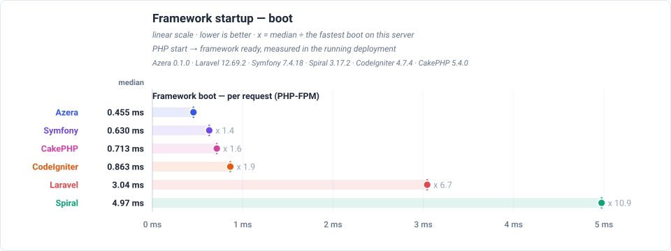
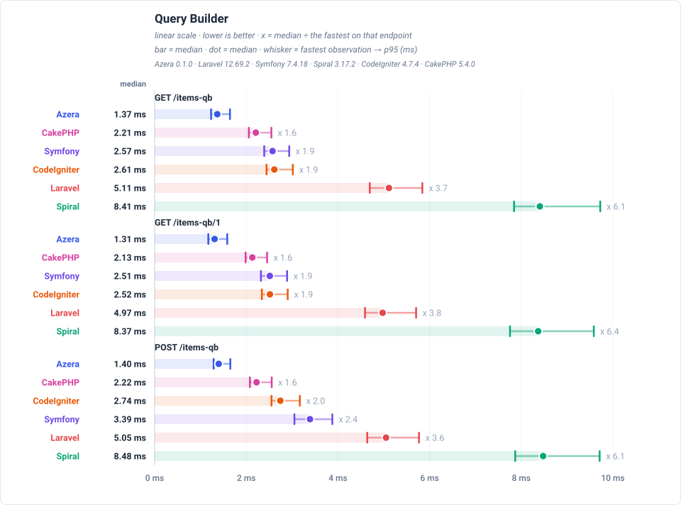
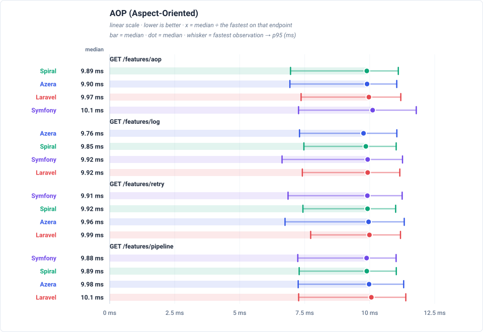
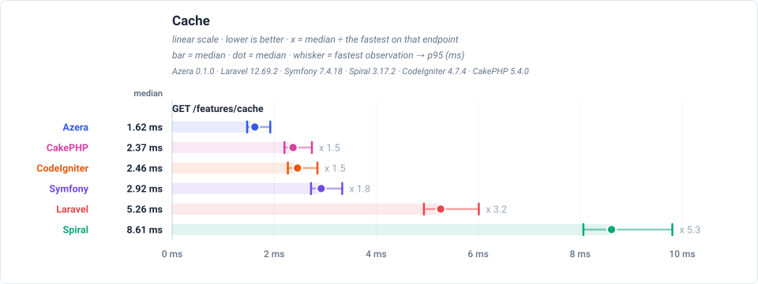
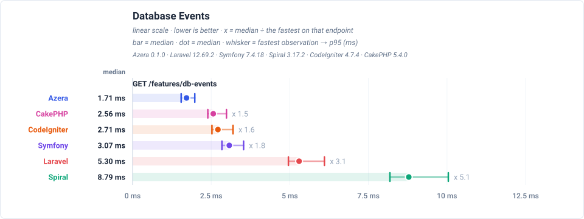
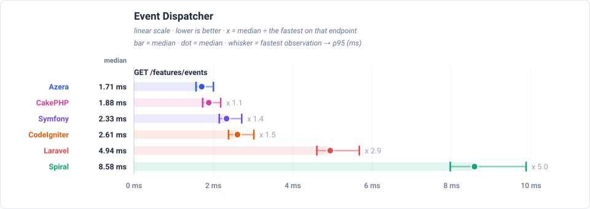
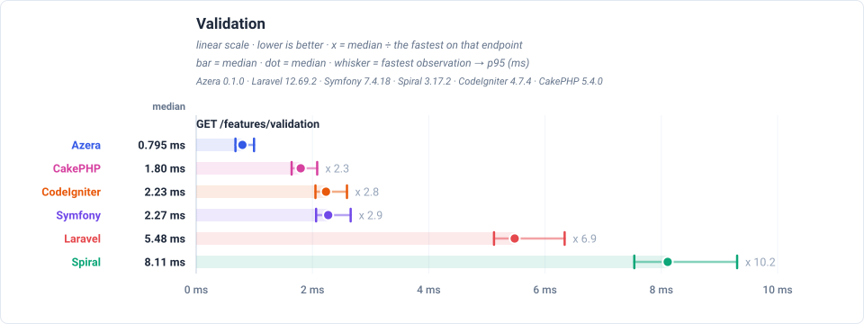
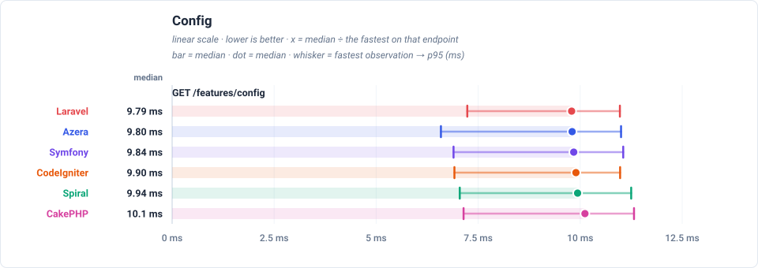
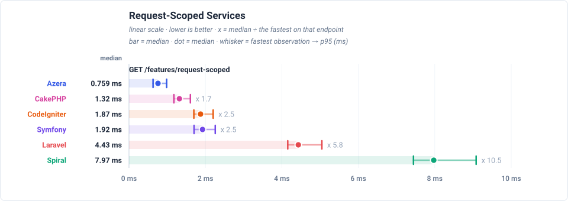
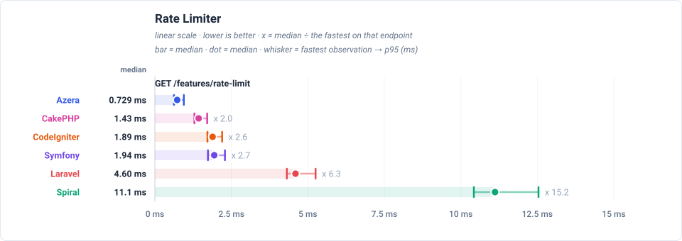

# Framework Competition — Real PHP-FPM

Real nginx + PHP-FPM serving over HTTP: the framework boots for every request, which is what PHP actually runs in production. The pool's worker-recycling setting is stated with the server floor below, since it changes what each row contains. End-to-end HTTP over loopback — includes the constant webserver overhead (see floor-http/floor-php in the dataset). Single sequential client.

**Environment** — PHP 8.3.33 · Linux 6.8.0-139-generic · OPcache (CLI): no · 300 iterations per run over multiple runs, lower is better.

_Measured 2026-09-14T21:22:18+00:00_

## Framework startup

Router + dispatcher + plain response, no database. The gap here is pure framework bootstrap and dispatch cost: **Azera** responds in 9.77 ms (median; 9.94 ms trimmed mean) against 9.95 ms (median) for CodeIgniter. Every framework lands within 5% of the fastest: the deployment is server-bound, so the ranking says more about the web server than about the frameworks.

## Total response times

Total time to serve one of each of the 21 endpoints — the sum of the endpoints' medians, not a single response time — relative to Azera (1.0 = the baseline's own total, higher = slower). Each endpoint's median is boot-inclusive occupancy for this view's deployment model, so the total is the worker time one pass over every endpoint costs. Every framework lands within 5% of Azera on the total: the deployment is server-bound, so the ranking says more about the web server than about the frameworks.

## Feature benchmarks

- **Routing** (`GET /`): Azera at 9.77ms median — every framework lands within 5% of it: the deployment is server-bound, so the ranking says more about the web server than about the frameworks.
- **ORM / Active Record** (`GET /items`): Azera at 9.79ms median — every framework lands within 5% of it: the deployment is server-bound, so the ranking says more about the web server than about the frameworks.
- **Query Builder** (`GET /items-qb`): Azera at 9.82ms median — every framework lands within 5% of it: the deployment is server-bound, so the ranking says more about the web server than about the frameworks.
- **REST API (JSON)** (`GET /api/items`): Symfony at 9.79ms median — every framework lands within 5% of it: the deployment is server-bound, so the ranking says more about the web server than about the frameworks.
- **AOP (Aspect-Oriented)** (`GET /features/aop`): Spiral at 9.89ms median — every framework lands within 5% of it: the deployment is server-bound, so the ranking says more about the web server than about the frameworks.
- **Cache** (`GET /features/cache`): Azera at 9.79ms median — every framework lands within 5% of it: the deployment is server-bound, so the ranking says more about the web server than about the frameworks.
- **Database Events** (`GET /features/db-events`): Spiral at 9.80ms median — every framework lands within 5% of it: the deployment is server-bound, so the ranking says more about the web server than about the frameworks.
- **Event Dispatcher** (`GET /features/events`): Azera at 9.83ms median — every framework lands within 5% of it: the deployment is server-bound, so the ranking says more about the web server than about the frameworks.
- **Validation** (`GET /features/validation`): Azera at 9.82ms median — every framework lands within 5% of it: the deployment is server-bound, so the ranking says more about the web server than about the frameworks.
- **Config** (`GET /features/config`): Laravel at 9.79ms median — every framework lands within 5% of it: the deployment is server-bound, so the ranking says more about the web server than about the frameworks.
- **Request-Scoped Services** (`GET /features/request-scoped`): Azera at 9.82ms median — every framework lands within 5% of it: the deployment is server-bound, so the ranking says more about the web server than about the frameworks.
- **Rate Limiter** (`GET /features/rate-limit`): Symfony at 9.89ms median — every framework lands within 5% of it: the deployment is server-bound, so the ranking says more about the web server than about the frameworks.

### Routing

### ORM / Active Record

### Query Builder

### REST API (JSON)

### AOP (Aspect-Oriented)

### Cache

### Database Events

### Event Dispatcher

### Validation

### Config

### Request-Scoped Services

### Rate Limiter

## Wins per framework

On this deployment the server floor dominates: the median endpoint puts every framework within 2.98% of the fastest, so the counts below record measurement noise rather than framework advantages. The honest reading is that the server, not the framework, decides the response time here.

| Framework | Wins | Share |
|---|---:|---:|
| Azera | 11 | 52% |
| Symfony | 7 | 33% |
| Spiral | 2 | 10% |
| Laravel | 1 | 5% |
| CodeIgniter | 0 | 0% |
| CakePHP | 0 | 0% |

## Latency by endpoint

Trimmed mean in milliseconds, lower is better. **Bold** = fastest for that endpoint. These are REAL deployments measured over HTTP: every row carries the constant server cost, which is why the values cluster — the floor note below states it explicitly. The workload column states what each request reads or writes — the shared SQLite database holds 1,000 item rows (re-seeded per app × mode), every list endpoint serves page 1 of 20, and every write upserts exactly one sentinel row.

**Server floor** — measured nginx + PHP-FPM with `pm.max_requests=?`: this dataset does not record whether the pool recycled its worker, so the per-request process-spawn share of this floor is unknown. A hello-world endpoint that boots nothing but PHP costs **9.23 ms** (`floor-php`), and a static file through nginx 0.073 ms (`floor-http`). Subtracting it leaves the framework's own per-request boot, but how much of this floor is a process spawn cannot be recovered from the dataset.

| Request | Workload | Azera | Laravel | Symfony | Spiral | CodeIgniter | CakePHP |
|---|---|---:|---:|---:|---:|---:|---:|
| `GET /` | no DB — routing + template only | 9.94 | 10.00 | **9.90** | 10.0 | 10.0 | 10.0 |
| `GET /items` | 20 of 1000 items (page 1, + COUNT) | **9.90** | 9.99 | 10.0 | 10.0 | 10.0 | 10.1 |
| `GET /items/1` | 1 item by id | **9.91** | 10.1 | 9.95 | 10.1 | 10.0 | 10.2 |
| `POST /items` | 1 row upserted (sentinel #999999) | 9.97 | 10.1 | **9.94** | 9.97 | 10.1 | 10.2 |
| `GET /items-qb` | 20 of 1000 items (page 1, + COUNT) | **9.94** | 9.98 | 9.94 | 10.1 | 10.1 | 10.2 |
| `GET /items-qb/1` | 1 item by id | 10.00 | **9.90** | 9.98 | 10.1 | 10.1 | 10.2 |
| `POST /items-qb` | 1 row upserted (sentinel #999997) | **9.89** | 9.95 | 9.92 | 10.00 | 10.1 | 10.2 |
| `GET /api/items` | 20 of 1000 items as JSON | 10.0 | 9.98 | **9.89** | 10.1 | 10.0 | 10.3 |
| `GET /api/items/1` | 1 item by id as JSON | **9.99** | 10.1 | 10.0 | 10.2 | 10.0 | 10.5 |
| `POST /api/items` | 1 row upserted (sentinel #999998) | **9.95** | 10.0 | 10.0 | 10.3 | 10.1 | 10.7 |
| `GET /features/aop` | no DB — interceptor pipeline | 10.0 | 10.1 | 10.3 | **10.00** | — | — |
| `GET /features/cache` | no DB — cache round-trips | **9.91** | 10.1 | 10.2 | 9.99 | 10.2 | 10.1 |
| `GET /features/log` | no DB — buffered log handlers | **9.88** | 10.0 | 10.0 | 9.95 | — | — |
| `GET /features/retry` | no DB — retry policy | 10.1 | 10.1 | **10.0** | 10.1 | — | — |
| `GET /features/pipeline` | no DB — middleware pipeline | 10.1 | 10.2 | **9.96** | 9.99 | — | — |
| `GET /features/db-events` | 1 event row INSERTed per request | 9.94 | 10.2 | 9.94 | **9.88** | 10.2 | 10.0 |
| `GET /features/events` | no DB — in-process listeners | **9.97** | 10.2 | 10.0 | 10.1 | 10.0 | 10.2 |
| `GET /features/validation` | no DB — validator run | 9.96 | 10.2 | **9.95** | 10.4 | 10.2 | 10.3 |
| `GET /features/config` | no DB — config lookup | **9.90** | 9.94 | 9.95 | 10.0 | 10.0 | 10.2 |
| `GET /features/request-scoped` | no DB — scoped service resolve | **9.95** | 10.1 | 10.1 | 9.95 | 10.0 | 10.0 |
| `GET /features/rate-limit` | no DB — cache-backed limiter | 10.1 | 10.0 | **10.0** | 10.1 | 10.0 | 10.5 |

---

> **Auto-generated.** This page and its charts are produced by the `azera-competition` repository:
> `php run.php --apps=azera,laravel,symfony,spiral,codeigniter,cakephp --warm --cold --seed --out=results/free-for-all-opcache-iso`
> then `php scripts/derive-fpm.php results/free-for-all-opcache-iso` and `php scripts/report.php --publish=framework`. Do not edit by hand — re-run the benchmark to update it.

Every chart is a plain SVG generated from the result JSON, so the numbers and the diagrams can never disagree.
