# Framework Competition — Real RoadRunner

Real RoadRunner server, resident PHP worker: the framework boots once, then serves every request. End-to-end HTTP over loopback — includes the constant webserver overhead (see floor-rr in the dataset); sub-0.1 ms framework differences are below this floor. Single sequential client.

**Environment** — PHP 8.3.33 · Linux 6.8.0-139-generic · OPcache (CLI): no · 1000 iterations per run over multiple runs, lower is better.

_Measured 2026-09-14T21:22:18+00:00_

## Framework startup

Router + dispatcher + plain response, no database. The gap here is pure framework bootstrap and dispatch cost: **Azera** responds in 0.255 ms (median; 0.273 ms trimmed mean) against 0.870 ms (median) for CodeIgniter — x 3.4 slower.

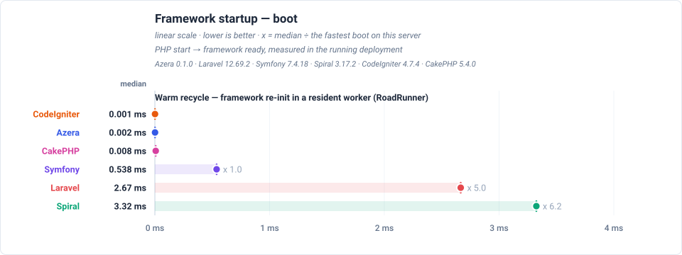

## Total response times

Total time to serve one of each of the 21 endpoints — the sum of the endpoints' medians, not a single response time — relative to Azera (1.0 = the baseline's own total, higher = slower). Each endpoint's median is boot-inclusive occupancy for this view's deployment model, so the total is the worker time one pass over every endpoint costs. The closest rival is Symfony, needing x 1.7 the same total.

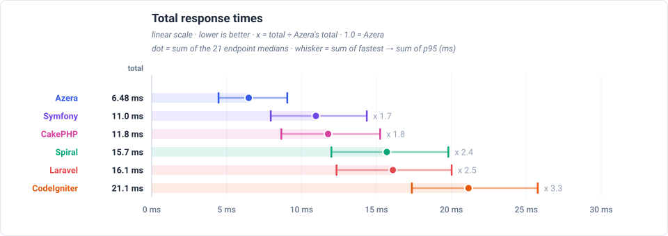

## Feature benchmarks

- **Routing** (`GET /`): Azera at 0.255ms median, x 1.5 faster than Symfony.
- **ORM / Active Record** (`GET /items`): Azera at 0.474ms median, x 2.0 faster than CakePHP.
- **Query Builder** (`GET /items-qb`): Azera at 0.413ms median, x 1.6 faster than Symfony.
- **REST API (JSON)** (`GET /api/items`): Azera at 0.327ms median, x 2.1 faster than CakePHP.
- **AOP (Aspect-Oriented)** (`GET /features/aop`): Azera at 0.432ms median, x 1.4 faster than Symfony.
- **Cache** (`GET /features/cache`): Azera at 0.243ms median, x 1.4 faster than Symfony.
- **Database Events** (`GET /features/db-events`): Azera at 0.299ms median, x 2.1 faster than Symfony.
- **Event Dispatcher** (`GET /features/events`): Azera at 0.312ms median, x 1.3 faster than Symfony.
- **Validation** (`GET /features/validation`): Azera at 0.270ms median, x 2.0 faster than CakePHP.
- **Config** (`GET /features/config`): Azera at 0.226ms median, x 1.5 faster than Symfony.
- **Request-Scoped Services** (`GET /features/request-scoped`): Azera at 0.233ms median, x 1.4 faster than Symfony.
- **Rate Limiter** (`GET /features/rate-limit`): Azera at 0.222ms median, x 1.7 faster than Symfony.

### Routing

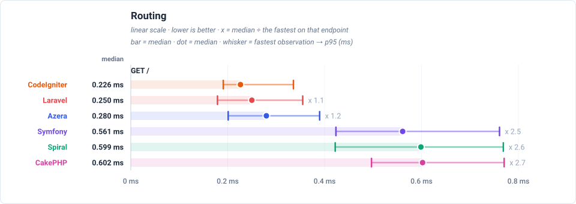

### ORM / Active Record

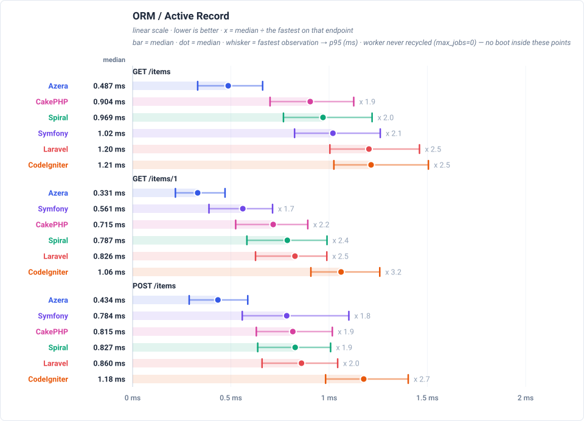

### Query Builder

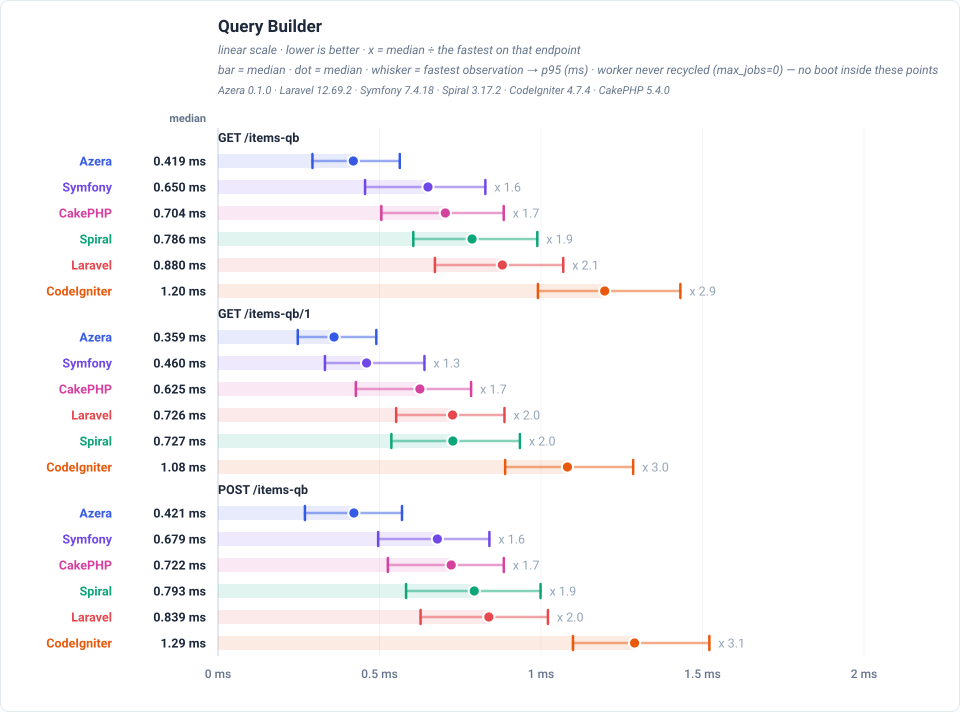

### REST API (JSON)

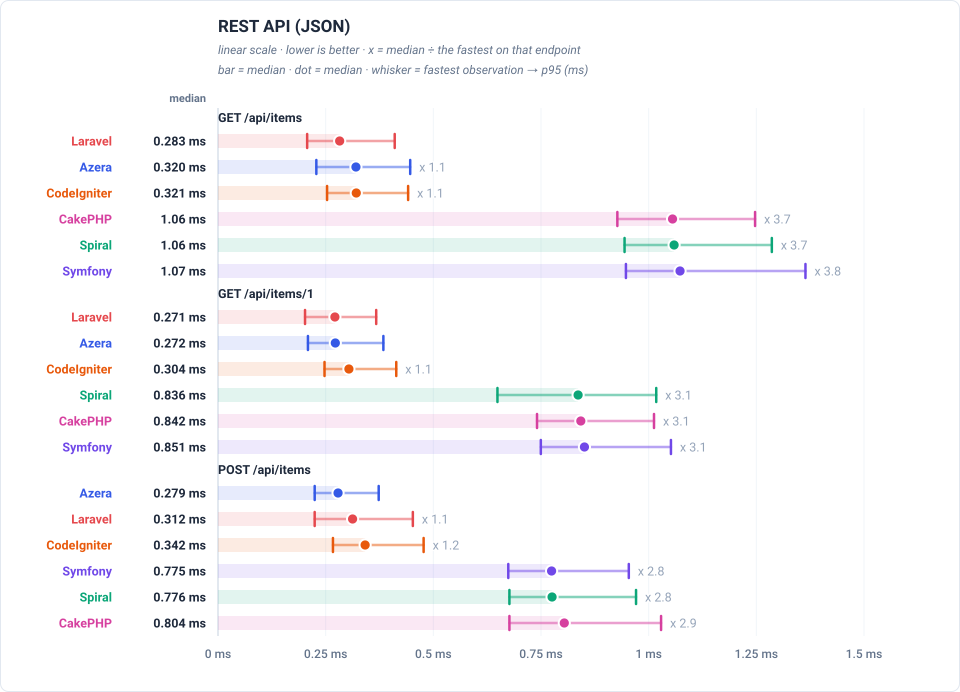

### AOP (Aspect-Oriented)

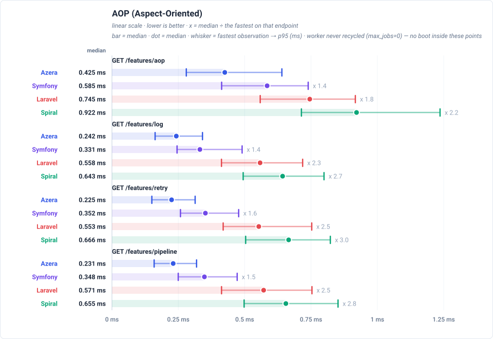

### Cache

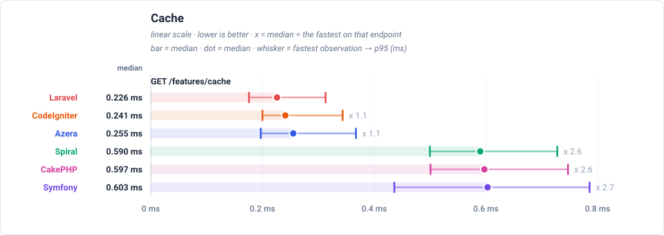

### Database Events

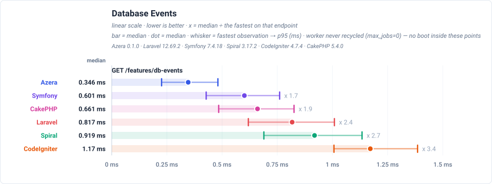

### Event Dispatcher

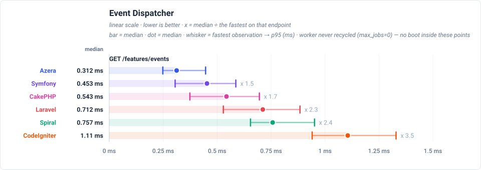

### Validation

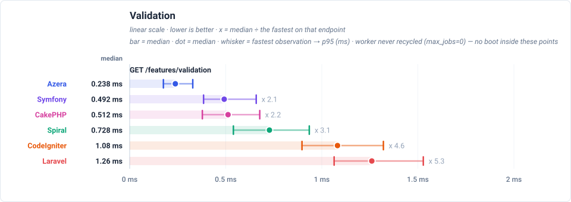

### Config

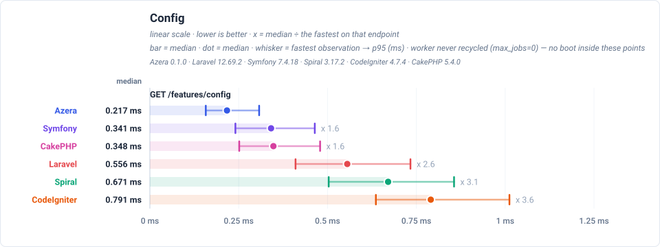

### Request-Scoped Services

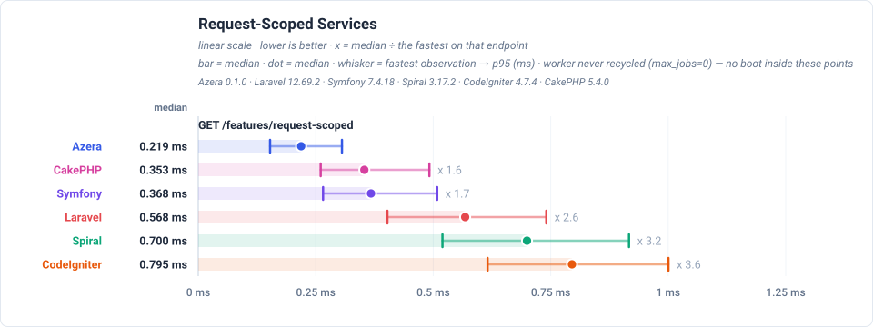

### Rate Limiter

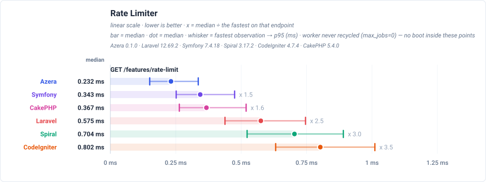

## Resident worker memory

Read from inside the live RoadRunner worker after each endpoint, on an extra untimed request that never touches the latency numbers. All six frameworks are drawn on one shared MB axis. The **left cap** is the PHP heap with the application booted and **no request served** — the framework's own data structures, with opcache bytecode excluded because it lives in shared memory. The **dot** is the heap after the last endpoint, and the **right cap** is the largest heap any endpoint reached. A narrow-left range that reaches far right is the shape worth watching: cheap to exist, expensive at its worst.

**CakePHP** needs 0.850 MB to exist, against 7.08 MB for Spiral (x 8.3 more). **CakePHP** is the exception: it reaches 40.6 MB against 0.850 MB at boot (x 47.7 more), and its heap is still higher than at the previous endpoint on 15 of the 20 steps through the suite — its cost grows with the number of distinct endpoints served, not with the request count.

Only the left cap ranks frameworks: it is a property of the worker, identical on every endpoint. The dot and the right cap are both endpoint-order dependent — the probe reads the whole heap once per endpoint, so it cannot say what one request costs on its own — which is why they are drawn as a range and the dot marks the end of the run rather than a lighter reading.

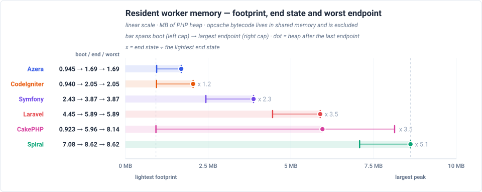

## Wins per framework

Number of endpoint races won (lowest boot-inclusive per-request time) per framework. This is a real server: a race won by less than the server floor and the run-to-run jitter is a tie, so read small leads cautiously.

| Framework | Wins | Share |
|---|---:|---:|
| Azera | 21 | 100% |
| Laravel | 0 | 0% |
| Symfony | 0 | 0% |
| Spiral | 0 | 0% |
| CodeIgniter | 0 | 0% |
| CakePHP | 0 | 0% |

## Latency by endpoint

Trimmed mean in milliseconds, lower is better. **Bold** = fastest for that endpoint. These are REAL deployments measured over HTTP: every row carries the constant server cost, which is why the values cluster — the floor note below states it explicitly. The workload column states what each request reads or writes — the shared SQLite database holds 1,000 item rows (re-seeded per app × mode), every list endpoint serves page 1 of 20, and every write upserts exactly one sentinel row.

**Server floor** — real RoadRunner over loopback: a bare resident worker that renders a fixed string costs **0.192 ms** (`floor-rr`) — the IPC + server floor every row below also pays. Only differences larger than this floor are framework differences.

| Request | Workload | Azera | Laravel | Symfony | Spiral | CodeIgniter | CakePHP |
|---|---|---:|---:|---:|---:|---:|---:|
| `GET /` | no DB — routing + template only | **0.273** | 0.618 | 0.406 | 0.660 | 0.890 | 0.482 |
| `GET /items` | 20 of 1000 items (page 1, + COUNT) | **0.488** | 1.22 | 1.08 | 1.01 | 1.25 | 0.989 |
| `GET /items/1` | 1 item by id | **0.354** | 0.866 | 0.588 | 0.804 | 1.12 | 0.765 |
| `POST /items` | 1 row upserted (sentinel #999999) | **0.466** | 0.882 | 0.812 | 0.857 | 1.21 | 0.872 |
| `GET /items-qb` | 20 of 1000 items (page 1, + COUNT) | **0.428** | 0.921 | 0.658 | 0.803 | 1.22 | 0.746 |
| `GET /items-qb/1` | 1 item by id | **0.364** | 0.774 | 0.521 | 0.740 | 1.11 | 0.670 |
| `POST /items-qb` | 1 row upserted (sentinel #999997) | **0.377** | 0.868 | 0.691 | 0.802 | 1.33 | 0.766 |
| `GET /api/items` | 20 of 1000 items as JSON | **0.341** | 1.06 | 0.689 | 0.838 | 1.06 | 0.702 |
| `GET /api/items/1` | 1 item by id as JSON | **0.317** | 0.857 | 0.503 | 0.747 | 1.03 | 0.646 |
| `POST /api/items` | 1 row upserted (sentinel #999998) | **0.317** | 0.765 | 0.741 | 0.776 | 1.10 | 0.784 |
| `GET /features/aop` | no DB — interceptor pipeline | **0.442** | 0.763 | 0.624 | 0.971 | — | — |
| `GET /features/cache` | no DB — cache round-trips | **0.257** | 0.621 | 0.368 | 0.693 | 0.811 | 0.392 |
| `GET /features/log` | no DB — buffered log handlers | **0.256** | 0.559 | 0.375 | 0.678 | — | — |
| `GET /features/retry` | no DB — retry policy | **0.240** | 0.617 | 0.398 | 0.709 | — | — |
| `GET /features/pipeline` | no DB — middleware pipeline | **0.248** | 0.581 | 0.372 | 0.693 | — | — |
| `GET /features/db-events` | 1 event row INSERTed per request | **0.318** | 0.848 | 0.646 | 0.930 | 1.16 | 0.694 |
| `GET /features/events` | no DB — in-process listeners | **0.330** | 0.730 | 0.430 | 0.777 | 1.14 | 0.563 |
| `GET /features/validation` | no DB — validator run | **0.283** | 1.30 | 0.558 | 0.732 | 1.11 | 0.550 |
| `GET /features/config` | no DB — config lookup | **0.240** | 0.590 | 0.362 | 0.674 | 0.823 | 0.390 |
| `GET /features/request-scoped` | no DB — scoped service resolve | **0.248** | 0.594 | 0.353 | 0.697 | 0.800 | 0.359 |
| `GET /features/rate-limit` | no DB — cache-backed limiter | **0.234** | 0.601 | 0.392 | 0.710 | 0.809 | 0.398 |

---

> **Auto-generated.** This page and its charts are produced by the `azera-competition` repository:
> `php run.php --apps=azera,laravel,symfony,spiral,codeigniter,cakephp --warm --cold --seed --out=results/free-for-all-opcache-iso`
> then `php scripts/derive-fpm.php results/free-for-all-opcache-iso` and `php scripts/report.php --publish=framework`. Do not edit by hand — re-run the benchmark to update it.

Every chart is a plain SVG generated from the result JSON, so the numbers and the diagrams can never disagree.
