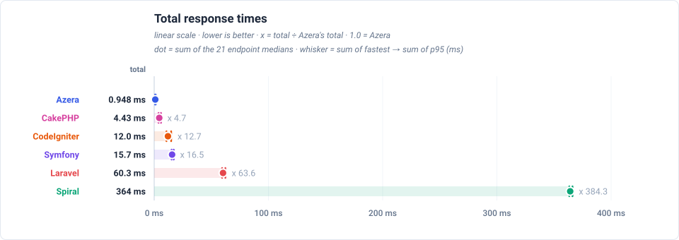

# Relative to Azera

The same dataset with Azera pinned at 1.0, so each framework reads as a multiple of the baseline instead of an absolute time.

**Environment** — PHP 8.3.6 · Linux 6.8.0-124-generic · OPcache (CLI): yes · 1000 iterations per run over multiple runs, lower is better.

_Measured 2026-09-12T14:43:29+00:00 · azera-framework `b1c4900`_

## Total response times

Total time to serve one of each of the 21 endpoints — the sum of the endpoints' medians, not a single response time — relative to Azera (1.0 = the baseline's own total, higher = slower). The closest rival is Symfony, needing x 3.7 the same total.

## Latency by endpoint

Trimmed mean in milliseconds, lower is better. **Bold** = fastest for that endpoint. The workload column states what each request reads or writes — the shared SQLite database holds 1,000 item rows (re-seeded per app × mode), every list endpoint serves page 1 of 20, and every write upserts exactly one sentinel row.

Each cell also shows the request's lifecycle split as `total handle + cleanup` — cleanup is the post-response teardown a long-lived worker performs between requests (terminate() finalizers, request-scoped resets), which the headline number includes.

| Request | Workload | Azera | Laravel | Symfony | Spiral | CodeIgniter | CakePHP |
|---|---|---:|---:|---:|---:|---:|---:|
| `GET /` | no DB — routing + template only | **0.016 0.016+0.001** | 0.218 0.218+0.000 | 0.090 0.088+0.002 | 0.284 0.274+0.010 | 0.466 0.457+0.009 | 0.140 0.139+0.000 |
| `GET /items` | 20 of 1000 items (page 1, + COUNT) | **0.143 0.139+0.003** | 0.753 0.753+0.000 | 0.540 0.537+0.003 | 0.573 0.556+0.017 | 0.767 0.754+0.012 | 0.508 0.508+0.000 |
| `GET /items/1` | 1 item by id | **0.054 0.052+0.002** | 0.399 0.398+0.000 | 0.172 0.170+0.002 | 0.390 0.377+0.013 | 0.668 0.656+0.012 | 0.333 0.333+0.000 |
| `POST /items` | 1 row upserted (sentinel #999999) | **0.109 0.107+0.002** | 0.431 0.430+0.000 | 0.337 0.334+0.003 | 0.441 0.428+0.013 | 0.747 0.734+0.013 | 0.445 0.445+0.000 |
| `GET /items-qb` | 20 of 1000 items (page 1, + COUNT) | **0.098 0.096+0.002** | 0.447 0.447+0.000 | 0.236 0.234+0.002 | 0.384 0.372+0.012 | 0.749 0.736+0.012 | 0.310 0.310+0.000 |
| `GET /items-qb/1` | 1 item by id | **0.052 0.051+0.002** | 0.320 0.320+0.000 | 0.141 0.139+0.002 | 0.342 0.330+0.011 | 0.661 0.649+0.012 | 0.239 0.238+0.000 |
| `POST /items-qb` | 1 row upserted (sentinel #999997) | **0.088 0.086+0.002** | 0.420 0.419+0.000 | 0.344 0.341+0.003 | 0.379 0.367+0.012 | 0.850 0.836+0.014 | 0.315 0.315+0.000 |
| `GET /api/items` | 20 of 1000 items as JSON | **0.043 0.041+0.001** | 0.635 0.635+0.000 | 0.233 0.231+0.002 | 0.446 0.430+0.016 | 0.613 0.602+0.011 | 0.278 0.278+0.000 |
| `GET /api/items/1` | 1 item by id as JSON | **0.039 0.037+0.002** | 0.421 0.420+0.000 | 0.151 0.149+0.002 | 0.350 0.337+0.013 | 0.581 0.570+0.011 | 0.248 0.247+0.000 |
| `POST /api/items` | 1 row upserted (sentinel #999998) | **0.054 0.053+0.002** | 0.356 0.355+0.000 | 0.298 0.295+0.003 | 0.392 0.379+0.013 | 0.650 0.639+0.011 | 0.344 0.343+0.000 |
| `GET /features/aop` | no DB — interceptor pipeline | **0.180 0.178+0.002** | 0.341 0.341+0.000 | 0.296 0.293+0.003 | 0.626 0.609+0.016 | — | — |
| `GET /features/cache` | no DB — cache round-trips | **0.015 0.013+0.001** | 0.249 0.249+0.000 | 0.086 0.084+0.002 | 0.329 0.319+0.010 | 0.445 0.436+0.009 | 0.108 0.108+0.000 |
| `GET /features/log` | no DB — buffered log handlers | **0.014 0.013+0.001** | 0.227 0.227+0.000 | 0.083 0.081+0.002 | 0.322 0.311+0.011 | — | — |
| `GET /features/retry` | no DB — retry policy | **0.011 0.010+0.001** | 0.239 0.239+0.000 | 0.088 0.086+0.002 | 0.332 0.322+0.010 | — | — |
| `GET /features/pipeline` | no DB — middleware pipeline | **0.015 0.014+0.001** | 0.229 0.228+0.000 | 0.083 0.081+0.002 | 0.323 0.313+0.010 | — | — |
| `GET /features/db-events` | 1 event row INSERTed per request | **0.045 0.043+0.002** | 0.413 0.413+0.000 | 0.202 0.200+0.002 | 0.504 0.492+0.013 | 0.749 0.737+0.012 | 0.277 0.277+0.000 |
| `GET /features/events` | no DB — in-process listeners | **0.043 0.041+0.002** | 0.317 0.316+0.000 | 0.116 0.114+0.002 | 0.382 0.371+0.011 | 0.705 0.693+0.012 | 0.187 0.186+0.000 |
| `GET /features/validation` | no DB — validator run | **0.020 0.019+0.001** | 0.884 0.883+0.000 | 0.197 0.195+0.002 | 0.352 0.341+0.010 | 0.682 0.668+0.013 | 0.195 0.195+0.000 |
| `GET /features/config` | no DB — config lookup | **0.010 0.009+0.001** | 0.234 0.233+0.000 | 0.083 0.081+0.002 | 0.318 0.308+0.010 | 0.424 0.415+0.009 | 0.099 0.098+0.000 |
| `GET /features/request-scoped` | no DB — scoped service resolve | **0.010 0.009+0.001** | 0.227 0.226+0.000 | 0.082 0.080+0.002 | 0.341 0.330+0.010 | 0.411 0.402+0.008 | 0.097 0.096+0.000 |
| `GET /features/rate-limit` | no DB — cache-backed limiter | **0.011 0.010+0.001** | 0.257 0.256+0.000 | 0.091 0.089+0.002 | 0.345 0.335+0.010 | 0.446 0.437+0.009 | 0.110 0.109+0.000 |

---

> **Auto-generated.** This page and its charts are produced by the `azera-competition` repository:
> `php run.php --apps=azera,laravel,symfony,spiral,codeigniter,cakephp --out=results/free-for-all-opcache --report`
> then `php scripts/report.php --publish=framework`. Do not edit by hand — re-run the benchmark to update it.

Every chart is a plain SVG generated from the result JSON, so the numbers and the diagrams can never disagree.
