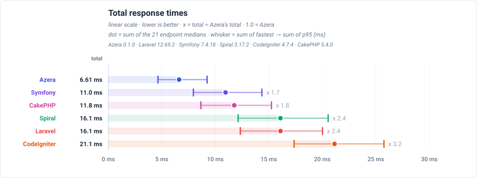
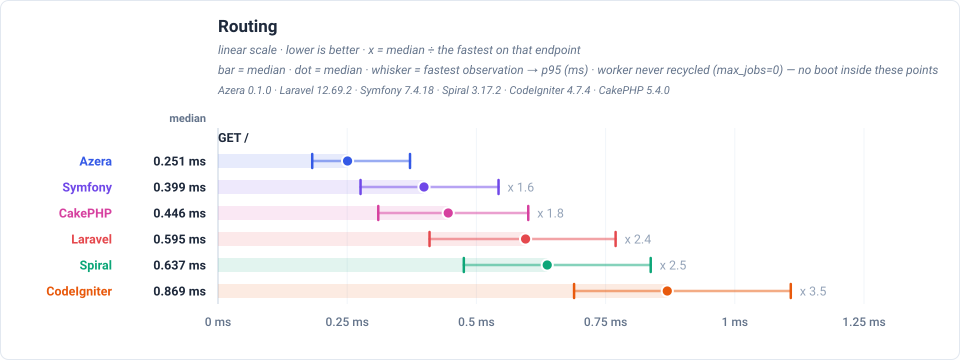
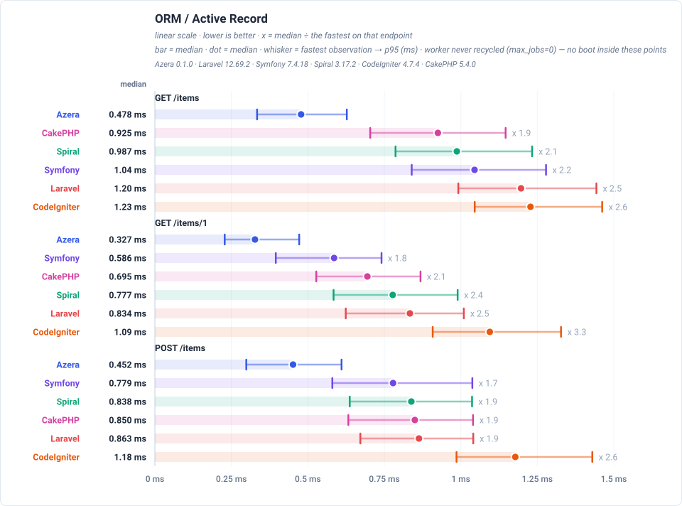
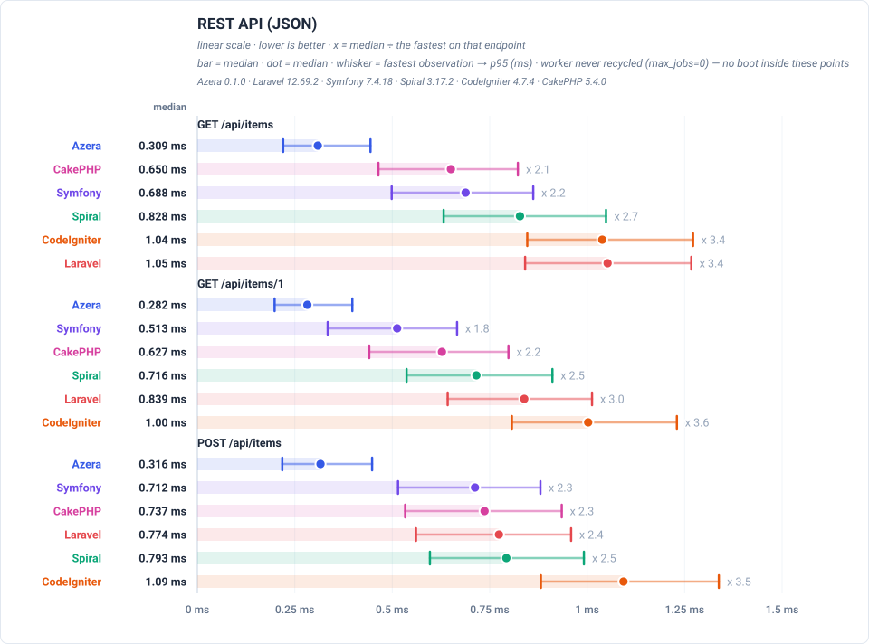
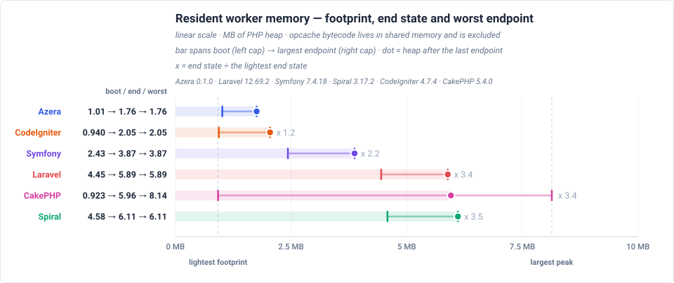

# Framework Competition — RoadRunner Summary

The headline numbers from the measured RoadRunner deployment: the cost of one pass over every endpoint, the plain routing request, the two data-access races, and the worker memory that survives a request. End-to-end HTTP over loopback, so the constant webserver overhead is included (see floor-rr in the dataset). The deployment model actually measured is stated with the table.

**Environment** — PHP 8.3.33 · Linux 6.8.0-139-generic · OPcache: yes · 1000 iterations per run over 10 runs, lower is better.

**Frameworks** — Azera 0.1.0 · Laravel 12.69.2 · Symfony 7.4.18 · Spiral 3.17.2 · CodeIgniter 4.7.4 · CakePHP 5.4.0.

_Measured 2026-09-15T23:21:30+00:00_

## Total response times

Total time to serve one pass over every benchmarked endpoint — each framework's sum of its endpoint medians, not a single response time — drawn relative to the baseline, so a row states how many times the baseline's own total it needed. Each endpoint's median is boot-inclusive occupancy for this view's deployment model, so the total is the worker time one pass over every endpoint costs. The chart orders the frameworks by that total and prints each one's multiplier beside its row.

## Feature benchmarks

One race per framework feature, each run as a real request against a real database. Each feature states the request it measures under its own heading. Every figure — the winner of each race and the margin over the runner-up — is in that feature's own chart below, which anchors each endpoint at its fastest framework.

### Routing
 `GET /` — dispatches a plain request through the router and returns a rendered template — no database access.

### ORM / Active Record
 `GET /items` — loads one page of the 1,000 seeded rows through each framework's ORM / Active Record layer: 20 items plus a COUNT for the pagination total.

### REST API (JSON)
 `GET /api/items` — serves the same page of items as a JSON response rather than HTML, which adds serialization to the ORM work.

## Resident worker memory

Read from inside the live worker after each endpoint, on an extra untimed request that never touches the latency numbers. All six frameworks are drawn on one shared MB axis. The **left cap** is the PHP heap with the application booted and **no request served** — the framework's own data structures, with opcache bytecode excluded because it lives in shared memory. The **dot** is the heap after the last endpoint, and the **right cap** is the largest heap any endpoint reached. A narrow-left range that reaches far right is the shape worth watching: cheap to exist, expensive at its worst.

The numbers are read from the resident RoadRunner worker, which answers them directly in response headers.

Rows are ordered by the **dot** — the heap the worker was left holding after its last endpoint — so the table reads as one ranking from lightest steady state to heaviest. The multiplier beside a row divides its dot by the lightest dot on the page; the reference row carries none. A row can therefore sit high while having the lightest left cap: that is a framework that is cheap to boot and expensive to keep running, which is exactly the distinction the three marks exist to draw.

The dot and the right cap are both endpoint-order dependent — the probe reads the whole heap once per endpoint, so it cannot say what one request costs on its own — which is why they are drawn as a range and the dot marks the end of the run rather than a lighter reading. That caveat bounds what the numbers MEAN; it does not invalidate the comparison, because every row is read from the same single sequence of endpoints and therefore at the same moment. What it rules out is reading any one of them as a per-request cost. The distance from the left cap to the right one, and the number of steps over which the heap rises, are the growth a long-lived worker accumulates.

## Latency by endpoint

Trimmed mean in milliseconds, lower is better. **Bold** = fastest for that endpoint. Every number is END-TO-END per-request occupancy for the view's deployment model: the framework boot of that model is part of the cell, not parked in a separate chart. These are REAL deployments measured over HTTP: every row carries the constant server cost, which is why the values cluster — the floor note below states what stands under them. The workload column states what each request reads or writes. Every framework runs the same seeded database and the same page size, so the payload is identical no matter which framework served it; the workload column is the part of the suite that varies.

These rows are end-to-end for a resident worker with a pool that never recycles it (max_jobs=0): the worker booted once before the first request and serves the whole run, so a cell is the measured request itself and carries no boot. The one-time recycle cost is measured in the full report linked at the foot of this page — read that when sizing a pool that is recycled or restarted, or when requests queue behind one worker.

**Server floor** — real RoadRunner over loopback: a bare resident worker that renders a fixed string (`floor-rr`) measures the IPC + server floor every row below also pays. Only differences larger than this floor are framework differences.

| Request | Workload | Azera | Laravel | Symfony | Spiral | CodeIgniter | CakePHP |
|---|---|---:|---:|---:|---:|---:|---:|
| `GET /` | no DB — routing + template only | **0.270** | 0.611 | 0.415 | 0.658 | 0.893 | 0.461 |
| `GET /items` | 20 of 1000 items (page 1, + COUNT) | **0.478** | 1.23 | 1.05 | 1.02 | 1.25 | 0.944 |
| `GET /items/1` | 1 item by id | **0.363** | 0.844 | 0.578 | 0.812 | 1.08 | 0.737 |
| `POST /items` | 1 row upserted (sentinel #999999) | **0.484** | 0.878 | 0.790 | 0.845 | 1.20 | 0.846 |
| `GET /items-qb` | 20 of 1000 items (page 1, + COUNT) | **0.435** | 0.895 | 0.669 | 0.803 | 1.23 | 0.734 |
| `GET /items-qb/1` | 1 item by id | **0.374** | 0.741 | 0.478 | 0.743 | 1.10 | 0.652 |
| `POST /items-qb` | 1 row upserted (sentinel #999997) | **0.436** | 0.859 | 0.698 | 0.814 | 1.32 | 0.752 |
| `GET /api/items` | 20 of 1000 items as JSON | **0.328** | 1.09 | 0.671 | 0.849 | 1.05 | 0.672 |
| `GET /api/items/1` | 1 item by id as JSON | **0.306** | 0.855 | 0.512 | 0.776 | 1.03 | 0.652 |
| `POST /api/items` | 1 row upserted (sentinel #999998) | **0.345** | 0.784 | 0.714 | 0.832 | 1.11 | 0.755 |
| `GET /features/aop` | no DB — interceptor pipeline | **0.459** | 0.770 | 0.596 | 0.988 | — | — |
| `GET /features/cache` | COUNT(*) of 1000 rows, cached 10s (miss = query) | **0.247** | 0.599 | 0.372 | 0.704 | 0.811 | 0.391 |
| `GET /features/log` | no DB — buffered log handlers | **0.249** | 0.571 | 0.354 | 0.691 | — | — |
| `GET /features/retry` | no DB — retry policy | **0.248** | 0.576 | 0.367 | 0.710 | — | — |
| `GET /features/pipeline` | no DB — middleware pipeline | **0.246** | 0.590 | 0.363 | 0.682 | — | — |
| `GET /features/db-events` | 1 event row INSERTed per request | **0.342** | 0.838 | 0.617 | 0.941 | 1.20 | 0.684 |
| `GET /features/events` | no DB — in-process listeners | **0.330** | 0.725 | 0.468 | 0.783 | 1.13 | 0.562 |
| `GET /features/validation` | no DB — validator run | **0.268** | 1.29 | 0.510 | 0.747 | 1.10 | 0.526 |
| `GET /features/config` | no DB — config lookup | **0.230** | 0.577 | 0.352 | 0.695 | 0.815 | 0.366 |
| `GET /features/request-scoped` | no DB — scoped service resolve | **0.232** | 0.582 | 0.355 | 0.716 | 0.778 | 0.374 |
| `GET /features/rate-limit` | no DB — cache-backed limiter | **0.239** | 0.598 | 0.365 | 0.723 | 0.818 | 0.395 |

**Full comparison** — this page is a summary. The complete report, with every feature chart and the endpoint table for all six frameworks, is published at:

- The complete report (all six frameworks, every feature chart) — <https://sailantis.github.io/azera-competition/benchmarks/>
- This model, measured end to end — <https://sailantis.github.io/azera-competition/benchmarks/view-real-roadrunner.html>
- The PHP-FPM summary — <https://sailantis.github.io/azera-competition/benchmarks/view-summary-fpm.html>

---

> **Auto-generated.** This page and its charts are produced by the `azera-competition` repository:
> `php run.php --apps=azera,laravel,symfony,spiral,codeigniter,cakephp --warm --cold --seed --out=results/free-for-all-opcache-iso`
> then `php scripts/derive-fpm.php results/free-for-all-opcache-iso` and `php scripts/report.php --publish=framework`. Do not edit by hand — re-run the benchmark to update it.

Every chart is a plain SVG generated from the result JSON, so the numbers and the diagrams can never disagree.
