# Template engine benchmark

Six engines render **the same pages** — a layout, an included partial, a loop over the items and nested loops inside it — so the numbers compare engines rather than templates. `Clarity` and `Native` are engines inside the Azera framework; the others are the template languages Azera adapts via its view adapter layer.

**Environment** — PHP 8.3.33 · Linux 6.8.0-139-generic · SAPI cli · OPcache (`opcache.enable_cli`): yes · Memory probe: `a fresh process with opcache.enable_cli=1 but a per-process CLI segment, so engine source is compiled in that process`

**Budget** — 10,000 renders × 30 runs, 200 items per render

**Method** — Steady-state timings: the render loop for each (engine, page) cell runs in its own fresh process against a warm cache: one untimed warm-up render, then runs x iterations-per-run timed renders. No order: each (engine, page) cell is measured in its own process, so measurement order cannot affect a cell. The first render was measured as one render in a fresh process with a cold template cache: engine class loading, template compile, cache write and one render.

**Engines** — Clarity dev-main (0a1c64d) · NativeEngine (Azera) dev-main (v0.1.0+dirty) · Plates 3.6.0 · Blade 12.69.2 · Twig 3.27.0 · Stempler 3.17.2

_Measured 2026-09-29T22:42:39+00:00_

## Scalars

The first of the rendering shapes measured here, rendered on the same machine with the same engines as the rest: a layout, an included partial, a loop over scalars with a filter, and a nested loop inside it. These are this page's own figures — a time here and a time further down are not the same measurement, so compare engines WITHIN a page rather than across pages.

## Time per render

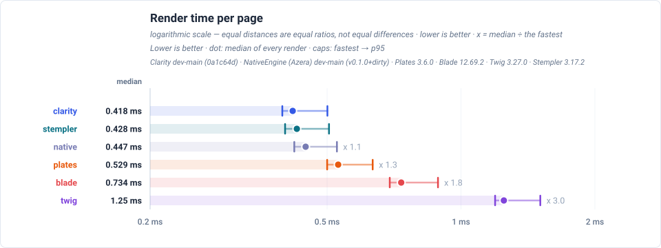

The dot is the median render and the caps bound the fastest observation and p95, so an engine that is usually fast but occasionally slow looks different from one that is uniformly slower. The multiplier beside each row is measured against the fastest median in the chart.

## First render

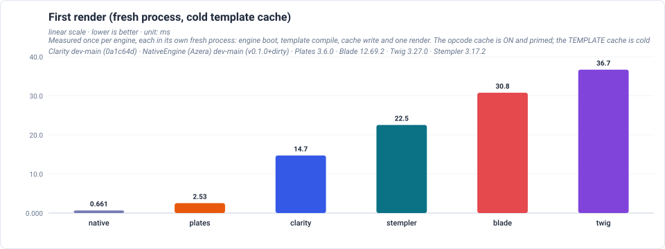

The cost of the first request after a deploy: the engine's classes load, the template compiles, the cache is written and the page renders once. It is measured in a FRESH process per engine, so no engine can be measured against a template cache or a bootstrap another engine already paid for. OPcache is ON and primed — as on a real deployment — so the engine's own PHP files are served from the shared opcode cache; only the TEMPLATE is cold. That makes it comparable across engines, and it is why the leading bar is a non-compiling engine: `native` has no compile step at all, so its first render is just a render. Engines that compile to a cached PHP class pay this once per deploy and nothing on later requests, which is what the render-time chart measures.

## Memory per run

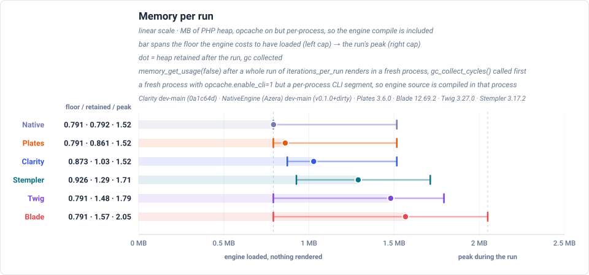

Three marks, three measurements — not a spread of repeats. The left cap is the heap with the engine loaded and nothing rendered, so it is the floor of having that engine at all. The dot is what a whole run of renders still holds, with the garbage collector run first. The right cap is the run's high-water mark, which is where the transient allocation of compiling the template lives. Each engine is measured in its own fresh process, so none of the three inherits another engine's footprint. Rows are sorted by the dot, lightest first.

## Results

Generated from the run's JSON — the same rows the charts above are drawn from, so a cell and a dot cannot disagree. Rows are ordered by median, fastest first.

| Engine | First render (ms) | Mean (ms) | Median (ms) | Min (ms) | p95 (ms) | Retained (MB) | Peak (MB) |
| --- | ---: | ---: | ---: | ---: | ---: | ---: | ---: |
| Clarity | 14.726 | 0.432 | 0.418 | 0.397 | 0.501 | 1.03 | 1.52 |
| Stempler | 22.536 | 0.440 | 0.428 | 0.402 | 0.505 | 1.29 | 1.71 |
| Native | 0.661 | 0.460 | 0.447 | 0.422 | 0.526 | 0.79 | 1.52 |
| Plates | 2.532 | 0.547 | 0.529 | 0.500 | 0.633 | 0.86 | 1.52 |
| Blade | 30.786 | 0.760 | 0.734 | 0.692 | 0.888 | 1.57 | 2.05 |
| Twig | 36.686 | 1.289 | 1.248 | 1.193 | 1.507 | 1.48 | 1.79 |

## Mixed — another rendering shape

Measured on the same machine with the same engines, rendering the heavy page: 20 flat variables each read twice (as text and as a data-value attribute) plus 20 rows of six fields each, over 40 flat variable accesses per render and 1440 in total at 200 items, with every value HTML-special so the escape path does real work in both the body and an attribute context. These are that page's own figures — a time here and a time above are not the same measurement, so compare engines WITHIN a page rather than across pages.

### Time per render — Mixed

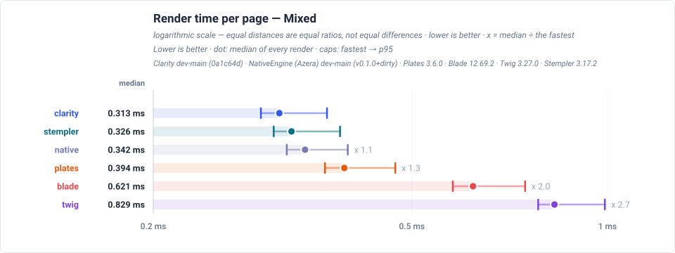

### First render (fresh process, cold template cache) — Mixed

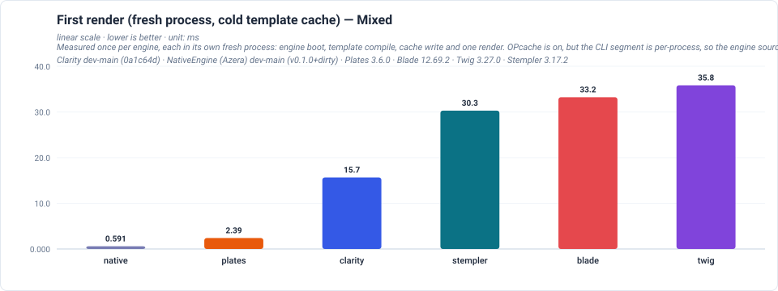

### Memory per run — Mixed

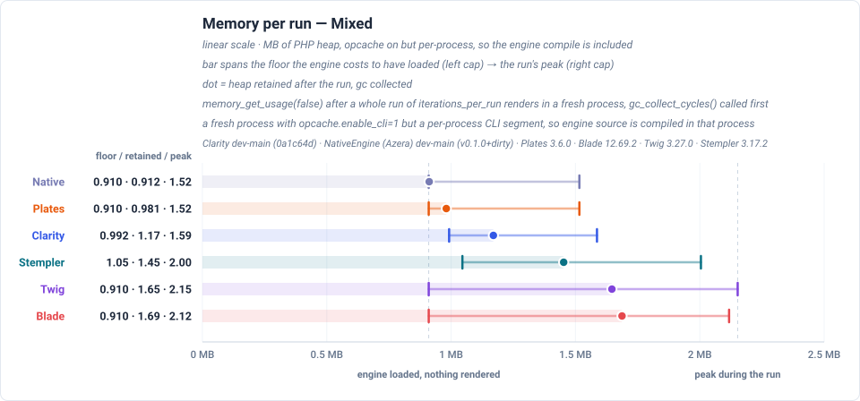

| Engine | First render (ms) | Mean (ms) | Median (ms) | Min (ms) | p95 (ms) | Retained (MB) | Peak (MB) |
| --- | ---: | ---: | ---: | ---: | ---: | ---: | ---: |
| Clarity | 15.653 | 0.322 | 0.313 | 0.293 | 0.370 | 1.17 | 1.59 |
| Stempler | 30.288 | 0.337 | 0.326 | 0.306 | 0.388 | 1.45 | 2.00 |
| Native | 0.591 | 0.353 | 0.342 | 0.321 | 0.398 | 0.91 | 1.52 |
| Plates | 2.392 | 0.406 | 0.394 | 0.368 | 0.471 | 0.98 | 1.52 |
| Blade | 33.222 | 0.639 | 0.621 | 0.578 | 0.747 | 1.69 | 2.12 |
| Twig | 35.839 | 0.854 | 0.829 | 0.782 | 0.991 | 1.65 | 2.15 |

## Objects — another rendering shape

Measured on the same machine with the same engines, rendering objects instead of scalars: two properties, a nested object, a nullable property behind a default, and an array inside an object. These are that page's own figures — a time here and a time above are not the same measurement, so compare engines WITHIN a page rather than across pages.

### Time per render — Objects

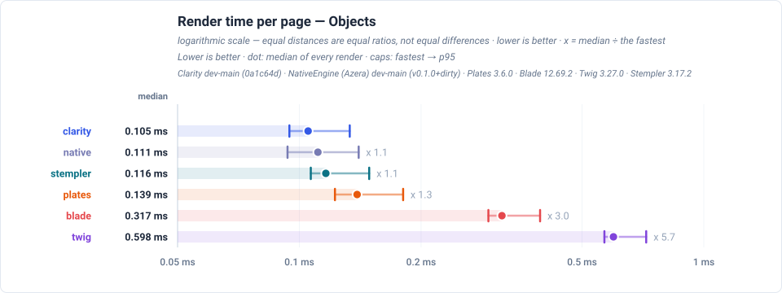

### First render (fresh process, cold template cache) — Objects

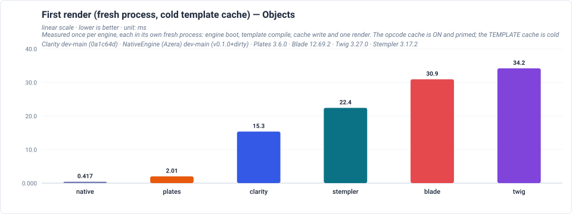

### Memory per run — Objects

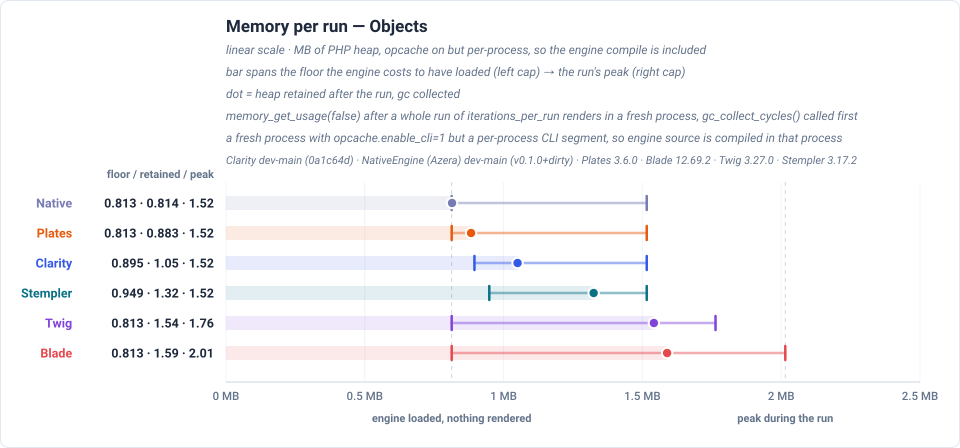

| Engine | First render (ms) | Mean (ms) | Median (ms) | Min (ms) | p95 (ms) | Retained (MB) | Peak (MB) |
| --- | ---: | ---: | ---: | ---: | ---: | ---: | ---: |
| Clarity | 15.339 | 0.111 | 0.105 | 0.095 | 0.133 | 1.05 | 1.52 |
| Native | 0.417 | 0.117 | 0.111 | 0.093 | 0.140 | 0.81 | 1.52 |
| Stempler | 22.398 | 0.123 | 0.116 | 0.107 | 0.149 | 1.32 | 1.52 |
| Plates | 2.010 | 0.148 | 0.139 | 0.122 | 0.181 | 0.88 | 1.52 |
| Blade | 30.908 | 0.329 | 0.317 | 0.293 | 0.394 | 1.59 | 2.01 |
| Twig | 34.159 | 0.619 | 0.598 | 0.568 | 0.720 | 1.54 | 1.76 |

## Objects as arrays — another rendering shape

Measured on the same machine with the same engines, rendering the same content in the same order with the same values held as nested arrays, so access shape is the only difference. These are that page's own figures — a time here and a time above are not the same measurement, so compare engines WITHIN a page rather than across pages.

### Time per render — Objects as arrays

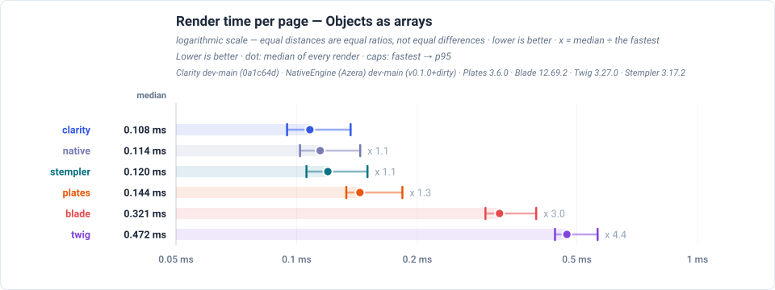

### First render (fresh process, cold template cache) — Objects as arrays

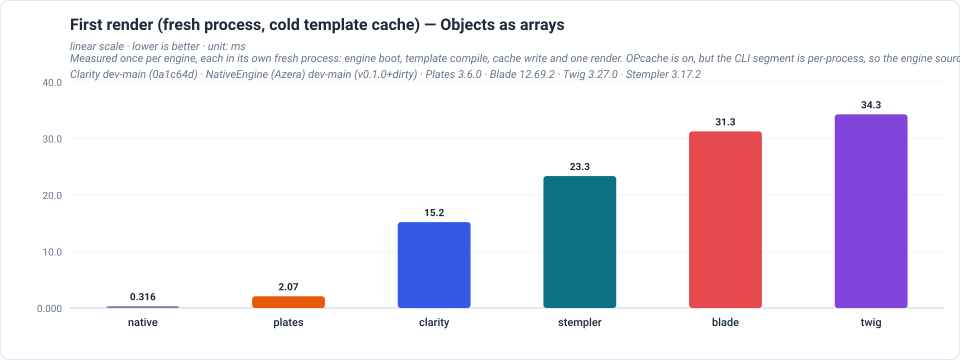

### Memory per run — Objects as arrays

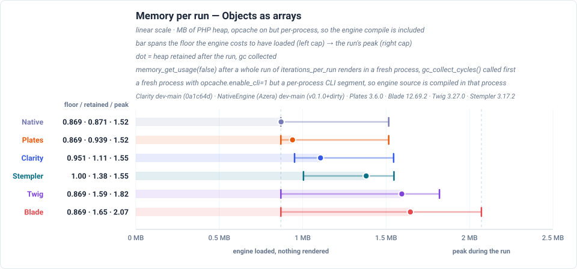

| Engine | First render (ms) | Mean (ms) | Median (ms) | Min (ms) | p95 (ms) | Retained (MB) | Peak (MB) |
| --- | ---: | ---: | ---: | ---: | ---: | ---: | ---: |
| Clarity | 15.202 | 0.113 | 0.108 | 0.095 | 0.136 | 1.11 | 1.55 |
| Native | 0.316 | 0.121 | 0.114 | 0.102 | 0.144 | 0.87 | 1.52 |
| Stempler | 23.347 | 0.126 | 0.120 | 0.106 | 0.150 | 1.38 | 1.55 |
| Plates | 2.072 | 0.152 | 0.144 | 0.133 | 0.184 | 0.94 | 1.52 |
| Blade | 31.259 | 0.332 | 0.321 | 0.296 | 0.396 | 1.65 | 2.07 |
| Twig | 34.280 | 0.488 | 0.472 | 0.441 | 0.563 | 1.59 | 1.82 |

### What the columns are

- **First render** — the first request after a deploy, measured in a fresh process per engine: engine boot, template compile, cache write and one render. The TEMPLATE cache is cold; the opcode cache is on and primed, as on a real deployment. Comparable across engines because no engine inherits another's warm template cache or loaded classes.
- **Mean / Median / Min / p95** — computed over every individual render across all runs.
- **Retained** — PHP heap still held after a whole run of renders, with `gc_collect_cycles()` called before the reading, in a fresh process. This is what a process carries while serving.
- **Peak** — the same run's PHP heap high-water mark, where the transient allocation of the first compile lives. It sits above Retained and is not a second measurement of it.

---

> **Auto-generated.** Reproduce with:
> `php -d opcache.enable_cli=1 benchmarks/view-engine/run.php --engines=native,clarity,plates,blade,twig,stempler --iterations-per-run=10000 --runs=30 --items=200 --out=results/<date>`
> then `php scripts/view-engine-report.php --dataset=benchmarks/view-engine/results-<date>.json`. Do not edit by hand — re-run the harness to update it.

Every chart is a plain SVG generated from the result JSON, so the numbers and the diagrams can never disagree.
