# Template engine benchmark

Seven engines render **the same pages** — a layout, an included partial, a loop over the items and nested loops inside it — so the numbers compare engines rather than templates. `Clarity` and `Native` are Azera engines; the others are the template languages Azera adapts.

**Environment** — PHP 8.3.33 · Linux 6.8.0-139-generic · SAPI cli · OPcache (`opcache.enable_cli`): yes

**Budget** — 10,000 renders × 30 runs, 200 items per render

**Method** — Steady-state timings: the render loop for each (engine, page) cell runs in its own fresh process against a warm cache: one untimed warm-up render, then runs x iterations-per-run timed renders. No order: each (engine, page) cell is measured in its own process, so measurement order cannot affect a cell. The first render was measured as one render in a fresh process with a cold template cache: engine class loading, template compile, cache write and one render.

**Engines** — Clarity dev-main (cbe1b05+dirty) · NativeEngine (Azera) dev-main (5a0c30e+dirty) · Plates 3.6.0 · Blade 12.69.2 · Twig 3.27.0 · Stempler 3.17.2 · Latte 3.1.6

_Measured 2026-09-30T23:30:00+00:00_

## Scalars

The first rendering shape measured here: a layout, an included partial, a loop over scalars with a filter, and a nested loop inside it. A time here and a time further down are not the same measurement — compare engines WITHIN a page.

## Time per render

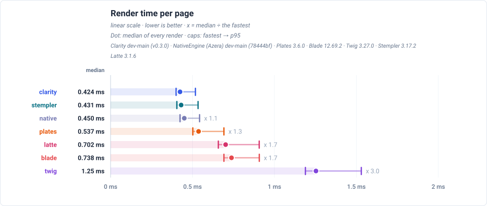

Dot: median render · caps: fastest observation and p95 · multiplier: median ÷ the fastest median.

## First render

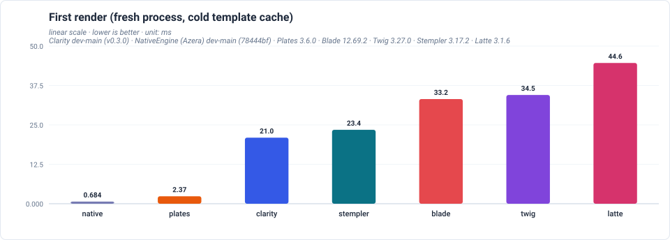

The first request after a deploy: engine classes load, the template compiles, the cache is written, the page renders once. Measured once per engine, each in its own fresh process; OPcache is on but its CLI segment is per-process, so the engine source is compiled there too. `native` has no compile step, so it leads; engines that compile pay this once per deploy only.

## Memory per run

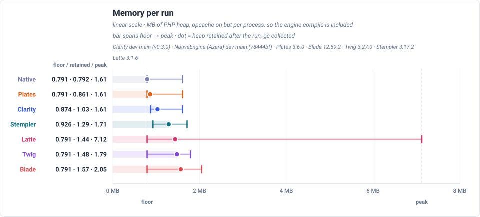

Reads the PHP heap. Left cap: what the engine costs to have loaded, nothing rendered. Dot: what a whole run still holds, after a gc pass — memory_get_usage(false) after a whole run of iterations_per_run renders in a fresh process, gc_collect_cycles() called first. Right cap: the run's high-water mark. Memory probe: a fresh process with opcache.enable_cli=1 but a per-process CLI segment, so engine source is compiled in that process. One fresh process per engine, so no reading inherits another's footprint. Rows are sorted by the dot, lightest first.

Latte's right cap is higher because its `{block}`/layout rendering creates reference cycles (about 4 KB per render) that PHP releases in batches, so the peak records the moment just before a release — a bounded transient, not a leak. The retained dot is the like-for-like figure on every engine.

## Results

Generated from the same rows the charts are drawn from. Rows are ordered by median, fastest first.

| Engine | First render (ms) | Mean (ms) | Median (ms) | Min (ms) | p95 (ms) | Retained (MB) | Peak (MB) |
| --- | ---: | ---: | ---: | ---: | ---: | ---: | ---: |
| Clarity | 16.276 | 0.436 | 0.421 | 0.397 | 0.507 | 1.03 | 1.61 |
| Stempler | 23.179 | 0.443 | 0.427 | 0.398 | 0.518 | 1.29 | 1.71 |
| Native | 0.686 | 0.464 | 0.449 | 0.423 | 0.537 | 0.79 | 1.61 |
| Plates | 2.684 | 0.551 | 0.531 | 0.493 | 0.644 | 0.86 | 1.61 |
| Latte | 46.966 | 0.720 | 0.692 | 0.661 | 0.840 | 1.44 | 7.12 |
| Blade | 31.396 | 0.750 | 0.724 | 0.687 | 0.873 | 1.57 | 2.05 |
| Twig | 35.577 | 1.288 | 1.249 | 1.195 | 1.506 | 1.48 | 1.79 |

## Mixed — another rendering shape

Rendering the heavy page: 20 flat variables each read twice (as text and as a data-value attribute) plus 20 rows of six fields each, over 40 flat variable accesses per render and 1440 in total at 200 items, with every value HTML-special so the escape path does real work in both the body and an attribute context. A time here and a time above are not the same measurement — compare engines WITHIN a page rather than across pages.

### Time per render — Mixed

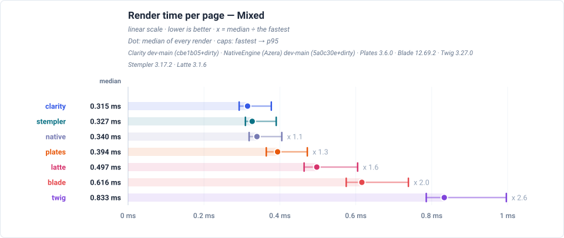

### First render (fresh process, cold template cache) — Mixed

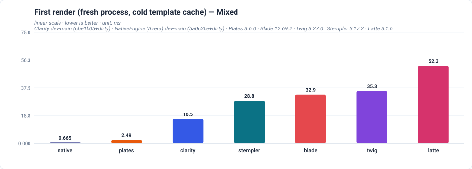

### Memory per run — Mixed

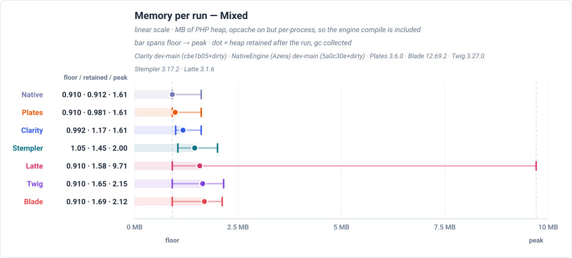

| Engine | First render (ms) | Mean (ms) | Median (ms) | Min (ms) | p95 (ms) | Retained (MB) | Peak (MB) |
| --- | ---: | ---: | ---: | ---: | ---: | ---: | ---: |
| Clarity | 16.544 | 0.325 | 0.315 | 0.293 | 0.377 | 1.17 | 1.61 |
| Stempler | 28.845 | 0.338 | 0.327 | 0.309 | 0.390 | 1.45 | 2.00 |
| Native | 0.665 | 0.350 | 0.340 | 0.319 | 0.405 | 0.91 | 1.61 |
| Plates | 2.491 | 0.407 | 0.394 | 0.364 | 0.472 | 0.98 | 1.61 |
| Latte | 52.328 | 0.517 | 0.497 | 0.464 | 0.605 | 1.58 | 9.71 |
| Blade | 32.909 | 0.634 | 0.616 | 0.575 | 0.739 | 1.69 | 2.12 |
| Twig | 35.309 | 0.859 | 0.833 | 0.786 | 0.997 | 1.65 | 2.15 |

## Objects — another rendering shape

Rendering objects instead of scalars: two properties, a nested object, a nullable property behind a default, and an array inside an object. A time here and a time above are not the same measurement — compare engines WITHIN a page rather than across pages.

### Time per render — Objects

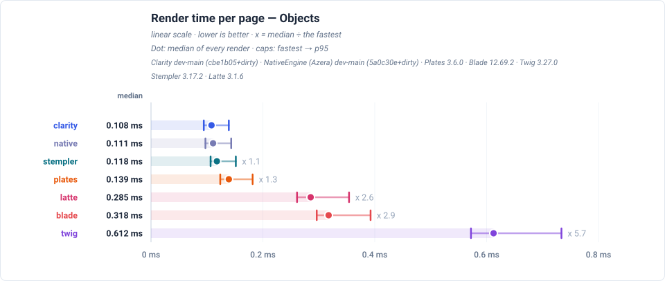

### First render (fresh process, cold template cache) — Objects

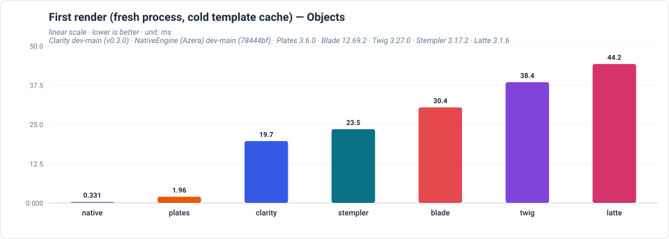

### Memory per run — Objects

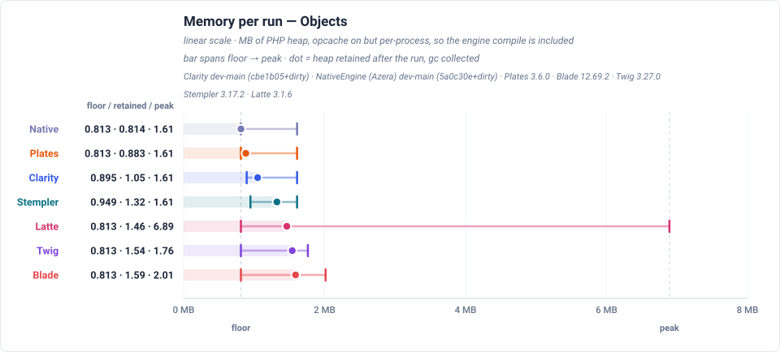

| Engine | First render (ms) | Mean (ms) | Median (ms) | Min (ms) | p95 (ms) | Retained (MB) | Peak (MB) |
| --- | ---: | ---: | ---: | ---: | ---: | ---: | ---: |
| Clarity | 16.580 | 0.114 | 0.108 | 0.094 | 0.139 | 1.05 | 1.61 |
| Native | 0.458 | 0.117 | 0.111 | 0.097 | 0.143 | 0.81 | 1.61 |
| Stempler | 23.729 | 0.124 | 0.118 | 0.107 | 0.152 | 1.32 | 1.61 |
| Plates | 2.467 | 0.148 | 0.139 | 0.124 | 0.182 | 0.88 | 1.61 |
| Latte | 45.775 | 0.299 | 0.285 | 0.261 | 0.354 | 1.46 | 6.89 |
| Blade | 32.062 | 0.329 | 0.318 | 0.296 | 0.393 | 1.59 | 2.01 |
| Twig | 36.359 | 0.633 | 0.612 | 0.572 | 0.734 | 1.54 | 1.76 |

## Objects as arrays — another rendering shape

Rendering the same content in the same order with the same values held as nested arrays, so access shape is the only difference. A time here and a time above are not the same measurement — compare engines WITHIN a page rather than across pages.

### Time per render — Objects as arrays

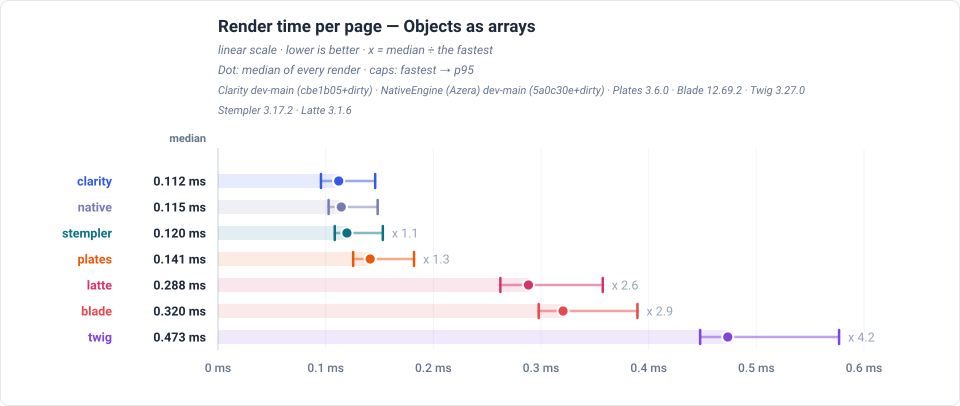

### First render (fresh process, cold template cache) — Objects as arrays

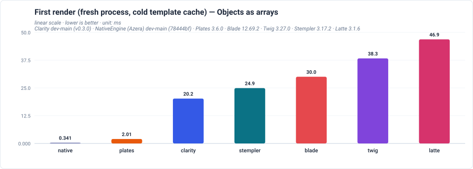

### Memory per run — Objects as arrays

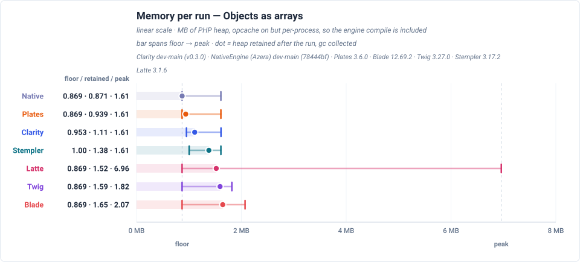

| Engine | First render (ms) | Mean (ms) | Median (ms) | Min (ms) | p95 (ms) | Retained (MB) | Peak (MB) |
| --- | ---: | ---: | ---: | ---: | ---: | ---: | ---: |
| Clarity | 15.971 | 0.119 | 0.112 | 0.096 | 0.146 | 1.11 | 1.61 |
| Native | 0.321 | 0.121 | 0.115 | 0.103 | 0.148 | 0.87 | 1.61 |
| Stempler | 22.801 | 0.126 | 0.120 | 0.108 | 0.153 | 1.38 | 1.61 |
| Plates | 2.059 | 0.150 | 0.141 | 0.126 | 0.182 | 0.94 | 1.61 |
| Latte | 47.737 | 0.302 | 0.288 | 0.262 | 0.357 | 1.52 | 6.96 |
| Blade | 29.716 | 0.331 | 0.320 | 0.298 | 0.390 | 1.65 | 2.07 |
| Twig | 34.921 | 0.492 | 0.473 | 0.448 | 0.577 | 1.59 | 1.82 |

### What the columns are

- **First render** — the first request after a deploy, in a fresh process per engine: boot, compile, cache write, one render. The template cache is cold.
- **Mean / Median / Min / p95** — over every individual render across all runs.
- **Retained** — heap still held after a whole run, after a gc pass, in a fresh process.
- **Peak** — the same run's high-water mark, where the first compile's transient allocation lives. Not a second measurement of Retained.

---

> **Auto-generated.** Reproduce with:
> `php -d opcache.enable_cli=1 benchmarks/view-engine/run.php --engines=native,clarity,plates,blade,twig,stempler,latte --iterations-per-run=10000 --runs=30 --items=200 --out=results/<date>`
> then `php scripts/view-engine-report.php --dataset=benchmarks/view-engine/results-<date>.json`. Do not edit by hand — re-run the harness to update it.

Every chart is a plain SVG generated from the result JSON, so the numbers and the diagrams can never disagree.
