# Framework Competition — Warm Start

RoadRunner/Octane-style resident worker: the framework boots once, then serves every request. Each number charges that boot per request, so a cell is the whole time one request keeps a worker busy — what a recycled pool or a queue behind one worker actually experiences. Full-stack request lifecycle benchmark (routing → controller → ORM query (SQLite) → template render → response).

**Environment** — PHP 8.3.33 · Linux 6.8.0-139-generic · OPcache: yes · 1000 iterations per run over 30 runs, lower is better.

**Frameworks** — Azera 0.1.0 (daeb5a6) · Laravel 12.69.2 · Symfony 7.4.18 · Spiral 3.17.2 · CodeIgniter 4.7.4 · CakePHP 5.4.0.

_Measured 2026-09-20T14:28:59+00:00 · azera-framework `daeb5a6`_

## Framework startup

Three boot models, timed directly by the harness — each band shows boot + median teardown, because during both the worker cannot serve another request:

- **Cold boot** — the very first bootstrap in a fresh PHP process (autoloader + compile + FS cache): what a CLI run, CGI request, or newly spawned worker pays once. This is the most expensive band, and the chart's multiplier states by how much.
- **FPM rebuild** — a recycled PHP-FPM worker never pays the first band: sharing opcache bytecode with the master, it only rebuilds the application (container, routes, DB connect). The gap between the cold and FPM bands is the one-time compile cost shared bytecode removes.
- **Warm recycle** — worker restart with opcache warm: a re-bootstrap with every class already loaded. CodeIgniter's and CakePHP's re-bootstrap is a state reset there, not a kernel rebuild, so they read near zero.

Post-response teardown is the third term of each row's sub-line below — the work a worker does between requests (terminate() finalizers, request-scoped resets) and the smallest of the three terms in every row here.

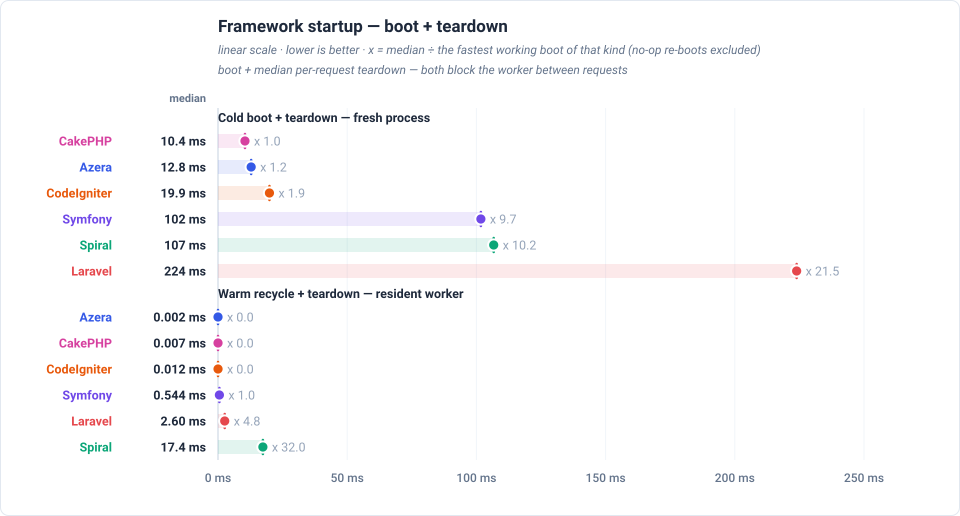

## Total response times

Total time to serve one pass over every benchmarked endpoint — each framework's sum of its endpoint medians, not a single response time — drawn relative to the baseline, so a row states how many times the baseline's own total it needed. Each endpoint's median is boot-inclusive occupancy for this view's deployment model, so the total is the worker time one pass over every endpoint costs. The chart orders the frameworks by that total and prints each one's multiplier beside its row.

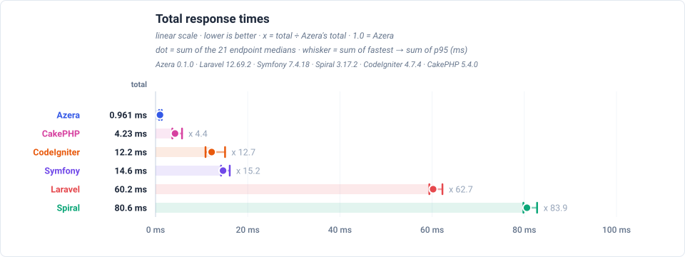

## Feature benchmarks

One race per framework feature, each run as a real request against a real database. Each feature states the request it measures under its own heading. Every figure — the winner of each race and the margin over the runner-up — is in that feature's own chart below, which anchors each endpoint at its fastest framework.

### Routing
 `GET /` — dispatches a plain request through the router and returns a rendered template — no database access.

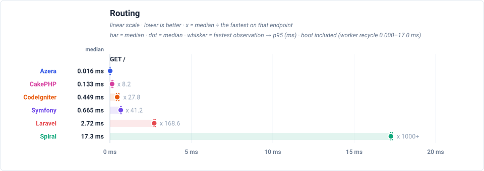

### ORM / Active Record
 `GET /items` — loads one page of the 1,000 seeded rows through each framework's ORM / Active Record layer: 20 items plus a COUNT for the pagination total.

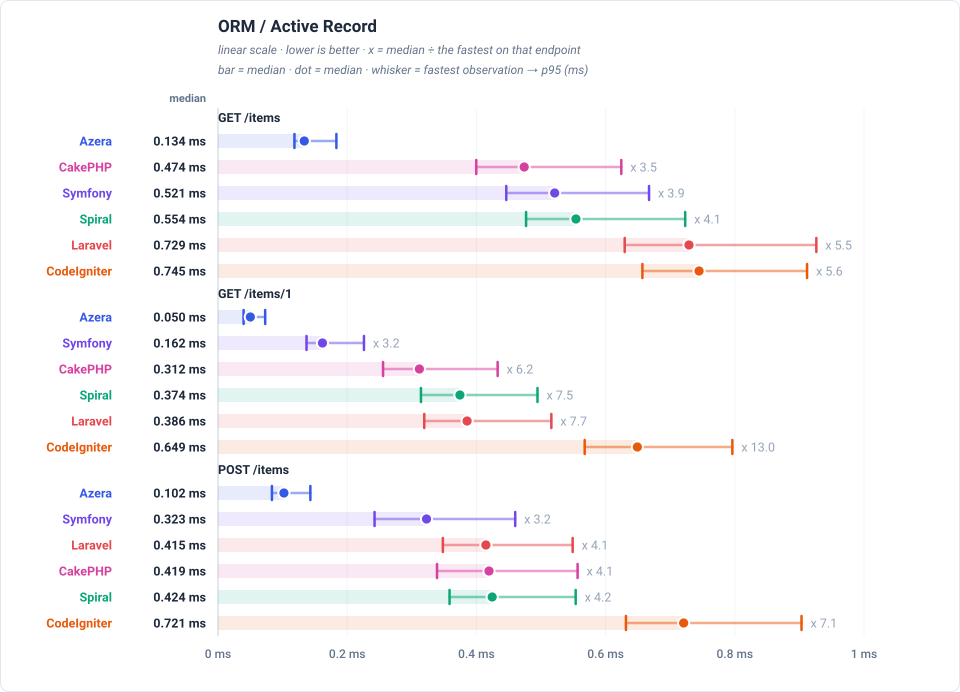

### Query Builder
 `GET /items-qb` — builds the same page of 20 items with each framework's query builder instead of its ORM, so the two data-access styles can be compared directly.

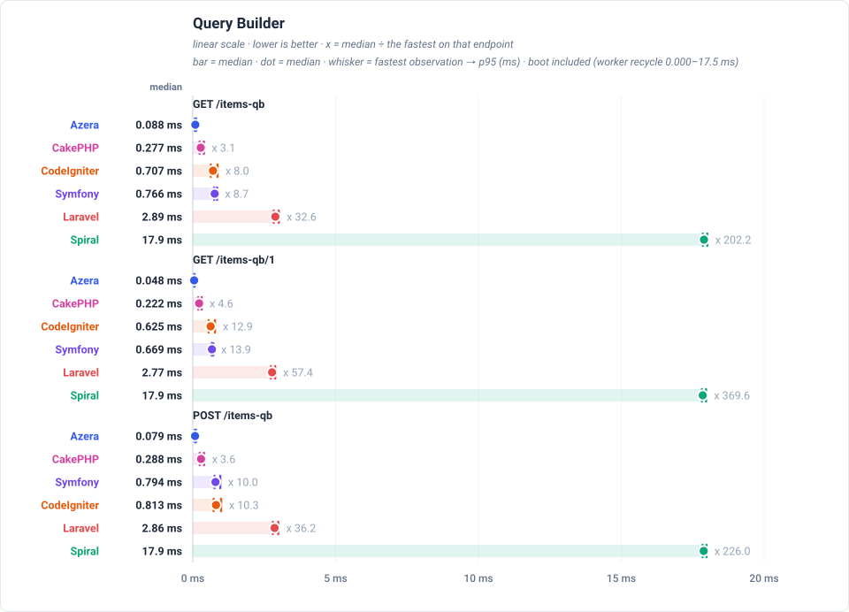

### REST API (JSON)
 `GET /api/items` — serves the same page of items as a JSON response rather than HTML, which adds serialization to the ORM work.

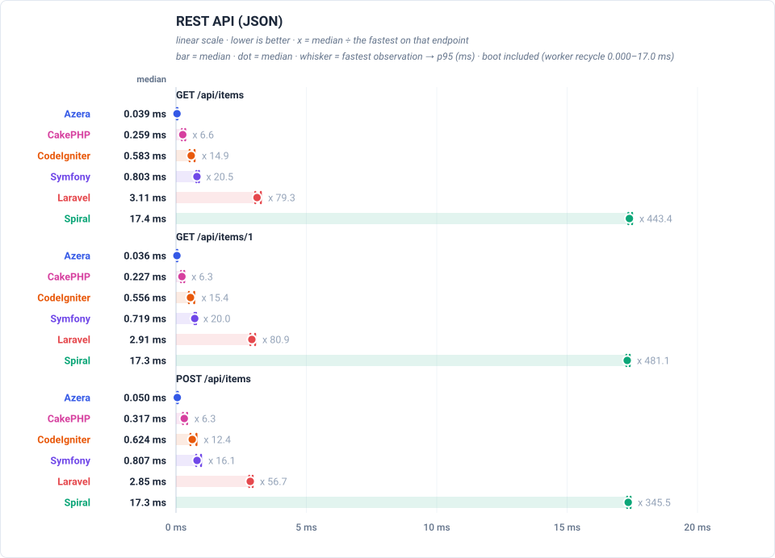

### AOP (Aspect-Oriented)
 `GET /features/aop` — runs a request through an interceptor pipeline — logging, retry and middleware aspects wrapped around the handler. Only frameworks with an AOP layer take part.

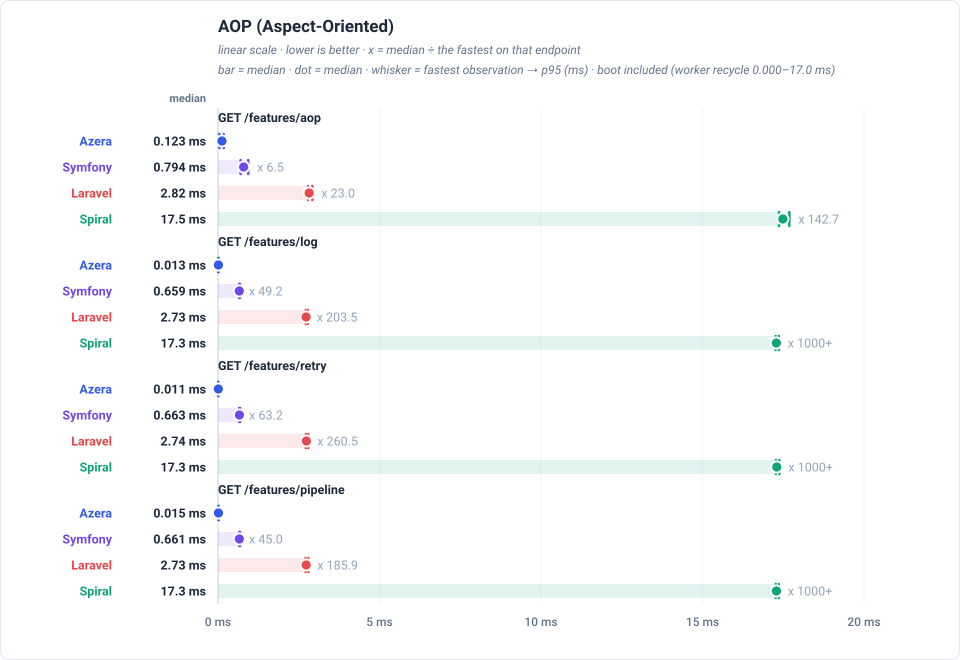

### Cache
 `GET /features/cache` — reads a COUNT(*) over the 1,000 rows through the framework's cache with a 10-second TTL, so a hit costs no database work and a miss runs the query.

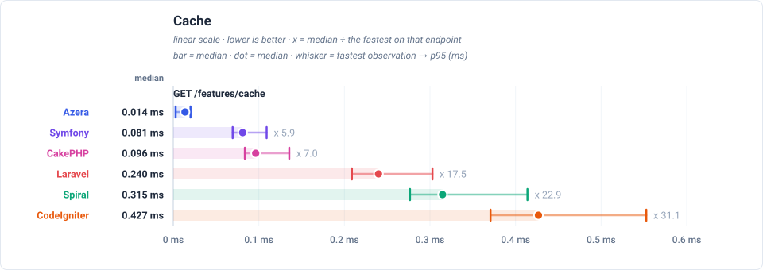

### Database Events
 `GET /features/db-events` — inserts one event row per request and lets the framework's database events fire around that write.

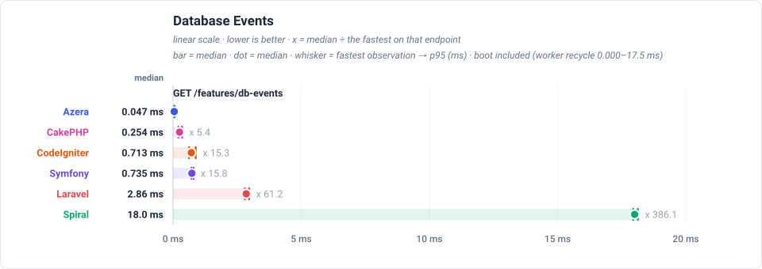

### Event Dispatcher
 `GET /features/events` — dispatches an in-process event to registered listeners.

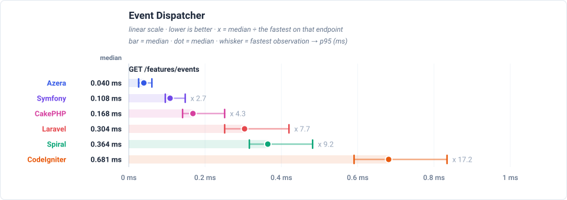

### Validation
 `GET /features/validation` — validates a payload with the framework's own validator.

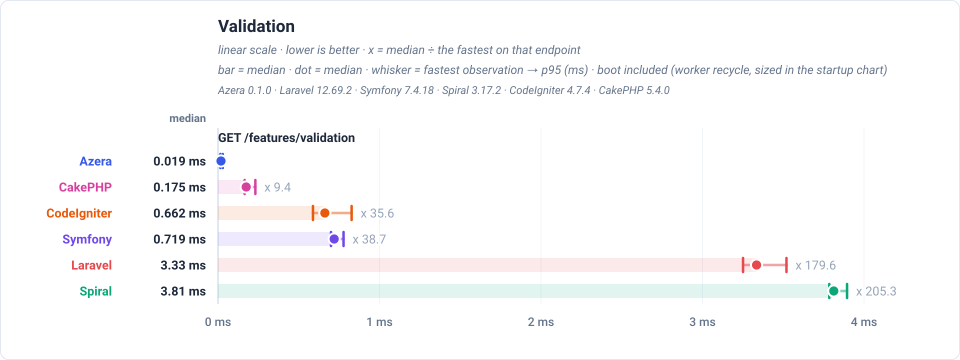

### Config
 `GET /features/config` — resolves a value from the framework's config repository.

### Request-Scoped Services
 `GET /features/request-scoped` — resolves a service scoped to the request from the container.

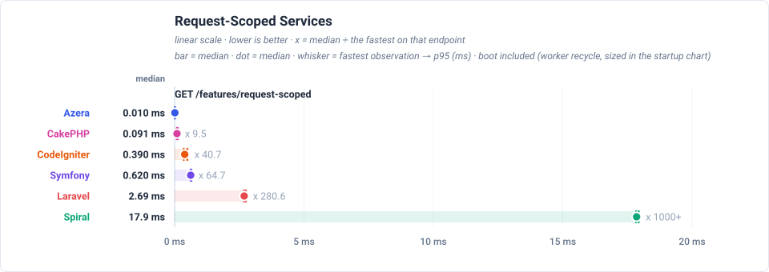

### Rate Limiter
 `GET /features/rate-limit` — checks a cache-backed rate limiter.

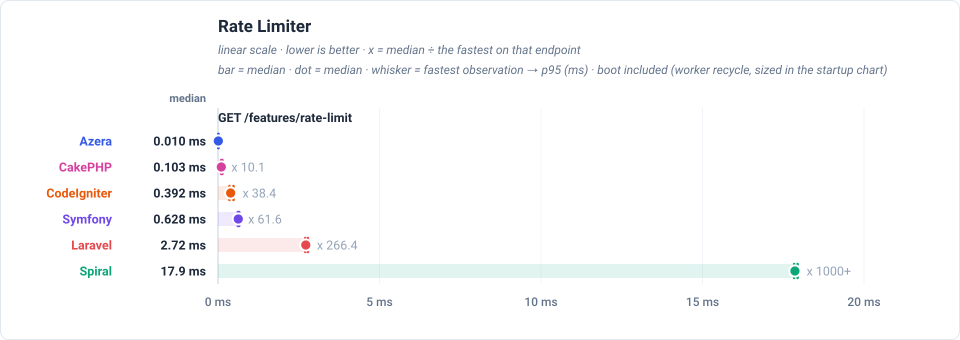

## Peak memory

Peak memory reached on any endpoint, in MB. Each row is one framework: the **bar** and the **dot** are its median endpoint, the **whisker** spans its lightest to its heaviest endpoint, and the multiplier beside the row states how many times the lightest framework's median it needed.

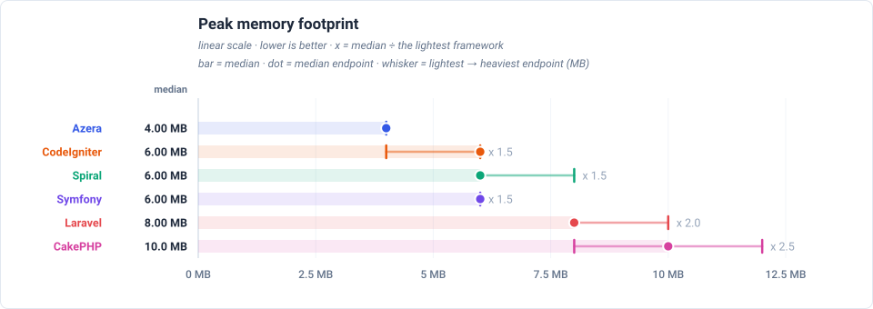

## Latency by endpoint

Trimmed mean in milliseconds, lower is better. **Bold** = fastest for that endpoint. Every number is END-TO-END per-request occupancy for the view's deployment model: the framework boot of that model is part of the cell, not parked in a separate chart. The workload column states what each request reads or writes. Every framework runs the same seeded database and the same page size, so the payload is identical no matter which framework served it; the workload column is the part of the suite that varies.

Each cell also shows the request's lifecycle split as `total boot + handle + cleanup` — the terms sum to the headline. Cleanup is the post-response teardown a worker performs between requests (terminate() finalizers, request-scoped resets); handle is the dispatch itself; boot is the framework startup that request waits for in this deployment model.

These rows are end-to-end for a resident worker: every headline and every chart point adds the worker's boot (warm recycle, measured in the startup chart) to the measured request, so a cell is the time one request keeps that worker busy — the number to read when workers are recycled per request or requests queue behind one pool. This dataset does not record the pool's max_jobs, so the boot is charged per request.

| Request | Workload | Azera | Laravel | Symfony | Spiral | CodeIgniter | CakePHP |
|---|---|---:|---:|---:|---:|---:|---:|
| `GET /` | no DB — routing + template only | **0.017 0.001+0.015+0.001** | 2.73 2.52+0.21+0.00 | 0.620 0.533+0.085+0.002 | 3.76 3.48+0.27+0.01 | 0.466 0.000+0.457+0.009 | 0.136 0.006+0.129+0.001 |
| `GET /items` | 20 of 1000 items (page 1, + COUNT) | **0.143 0.001+0.139+0.003** | 3.25 2.51+0.74+0.00 | 1.07 0.54+0.53+0.00 | 4.03 3.48+0.53+0.02 | 0.761 0.000+0.749+0.012 | 0.488 0.006+0.481+0.001 |
| `GET /items/1` | 1 item by id | **0.054 0.001+0.051+0.002** | 2.90 2.51+0.39+0.00 | 0.701 0.534+0.165+0.002 | 3.85 3.48+0.36+0.01 | 0.664 0.000+0.652+0.012 | 0.313 0.006+0.306+0.001 |
| `POST /items` | 1 row upserted (sentinel #999999) | **0.110 0.001+0.107+0.002** | 2.93 2.52+0.41+0.00 | 0.789 0.533+0.253+0.003 | 3.90 3.48+0.41+0.01 | 0.737 0.000+0.725+0.012 | 0.423 0.006+0.416+0.001 |
| `GET /items-qb` | 20 of 1000 items (page 1, + COUNT) | **0.095 0.001+0.093+0.001** | 2.94 2.52+0.42+0.00 | 0.770 0.533+0.235+0.002 | 3.86 3.49+0.36+0.01 | 0.747 0.000+0.735+0.012 | 0.287 0.006+0.280+0.001 |
| `GET /items-qb/1` | 1 item by id | **0.051 0.001+0.049+0.001** | 2.82 2.51+0.31+0.00 | 0.669 0.533+0.134+0.002 | 3.81 3.48+0.32+0.01 | 0.656 0.000+0.644+0.012 | 0.226 0.006+0.219+0.001 |
| `POST /items-qb` | 1 row upserted (sentinel #999997) | **0.085 0.001+0.083+0.001** | 2.91 2.51+0.40+0.00 | 0.807 0.533+0.271+0.003 | 3.85 3.49+0.35+0.01 | 0.849 0.000+0.836+0.013 | 0.295 0.006+0.288+0.001 |
| `GET /api/items` | 20 of 1000 items as JSON | **0.041 0.001+0.039+0.001** | 3.13 2.52+0.61+0.00 | 0.763 0.534+0.227+0.002 | 3.90 3.49+0.40+0.01 | 0.610 0.000+0.600+0.010 | 0.265 0.006+0.258+0.001 |
| `GET /api/items/1` | 1 item by id as JSON | **0.039 0.001+0.037+0.001** | 2.91 2.51+0.40+0.00 | 0.678 0.533+0.143+0.002 | 3.82 3.49+0.32+0.01 | 0.577 0.000+0.566+0.011 | 0.233 0.006+0.226+0.001 |
| `POST /api/items` | 1 row upserted (sentinel #999998) | **0.056 0.001+0.053+0.002** | 2.86 2.51+0.35+0.00 | 0.772 0.534+0.236+0.002 | 3.85 3.48+0.36+0.01 | 0.651 0.000+0.640+0.011 | 0.320 0.006+0.313+0.001 |
| `GET /features/aop` | no DB — interceptor pipeline | **0.130 0.001+0.128+0.001** | 2.84 2.52+0.32+0.00 | 0.759 0.534+0.223+0.002 | 4.00 3.48+0.51+0.01 | — | — |
| `GET /features/cache` | COUNT(*) of 1000 rows, cached 10s (miss = query) | **0.014 0.001+0.012+0.001** | 2.76 2.52+0.24+0.00 | 0.618 0.533+0.083+0.002 | 3.80 3.48+0.31+0.01 | 0.414 0.000+0.406+0.008 | 0.106 0.006+0.099+0.001 |
| `GET /features/log` | no DB — buffered log handlers | **0.014 0.001+0.012+0.001** | 2.73 2.51+0.22+0.00 | 0.614 0.533+0.079+0.002 | 3.79 3.48+0.30+0.01 | — | — |
| `GET /features/retry` | no DB — retry policy | **0.011 0.001+0.009+0.001** | 2.74 2.51+0.23+0.00 | 0.620 0.534+0.084+0.002 | 3.80 3.48+0.31+0.01 | — | — |
| `GET /features/pipeline` | no DB — middleware pipeline | **0.015 0.001+0.013+0.001** | 2.74 2.52+0.22+0.00 | 0.617 0.534+0.081+0.002 | 3.80 3.48+0.31+0.01 | — | — |
| `GET /features/db-events` | 1 event row INSERTed per request | **0.049 0.001+0.047+0.001** | 2.91 2.52+0.39+0.00 | 0.736 0.534+0.200+0.002 | 3.97 3.48+0.48+0.01 | 0.742 0.000+0.730+0.012 | 0.259 0.006+0.252+0.001 |
| `GET /features/events` | no DB — in-process listeners | **0.040 0.001+0.038+0.001** | 2.81 2.51+0.30+0.00 | 0.649 0.533+0.114+0.002 | 3.85 3.48+0.36+0.01 | 0.703 0.000+0.691+0.012 | 0.151 0.006+0.144+0.001 |
| `GET /features/validation` | no DB — validator run | **0.020 0.001+0.018+0.001** | 3.36 2.51+0.85+0.00 | 0.729 0.534+0.193+0.002 | 3.83 3.49+0.33+0.01 | 0.684 0.000+0.671+0.013 | 0.189 0.006+0.182+0.001 |
| `GET /features/config` | no DB — config lookup | **0.010 0.001+0.008+0.001** | 2.74 2.52+0.22+0.00 | 0.616 0.533+0.081+0.002 | 3.79 3.48+0.30+0.01 | 0.423 0.000+0.415+0.008 | 0.095 0.006+0.088+0.001 |
| `GET /features/request-scoped` | no DB — scoped service resolve | **0.010 0.001+0.008+0.001** | 2.73 2.51+0.22+0.00 | 0.614 0.533+0.079+0.002 | 3.81 3.48+0.32+0.01 | 0.407 0.000+0.399+0.008 | 0.094 0.006+0.087+0.001 |
| `GET /features/rate-limit` | no DB — cache-backed limiter | **0.011 0.001+0.009+0.001** | 2.76 2.51+0.25+0.00 | 0.623 0.533+0.088+0.002 | 3.82 3.48+0.33+0.01 | 0.414 0.000+0.406+0.008 | 0.106 0.006+0.099+0.001 |

---

> **Auto-generated.** This page and its charts are produced by the `azera-competition` repository:
> `php run.php --apps=azera,laravel,symfony,spiral,codeigniter,cakephp --warm --cold --seed --out=results/free-for-all-opcache-iso`
> then `php scripts/derive-fpm.php results/free-for-all-opcache-iso` and `php scripts/report.php`. Do not edit by hand — re-run the benchmark to update it.

Every chart is a plain SVG generated from the result JSON, so the numbers and the diagrams can never disagree.
